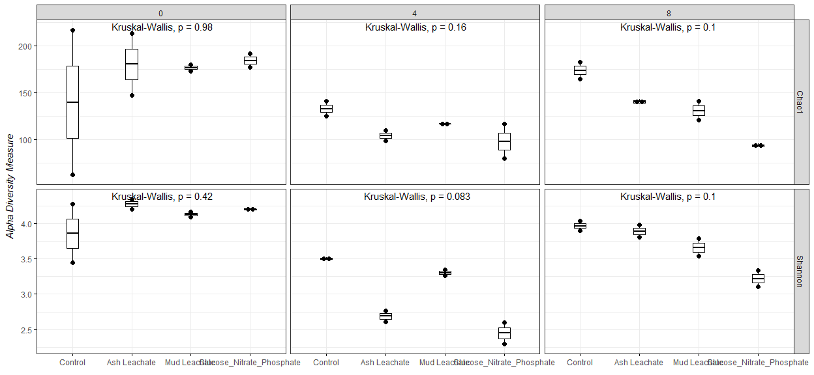
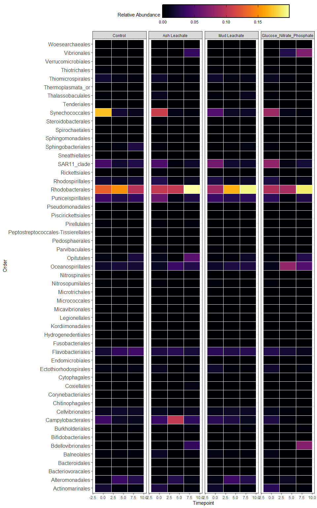

Phyloseq Amplicon Analysis
================
Oceana Tavasieff
11/18/2020

# Install phyloseq

``` r
#BiocManager::install("phyloseq")
```

``` r
library(tidyverse)
library(phyloseq)
library(RColorBrewer)
```

# Import Data

``` r
count.tab <- read_rds("~/Documents/github_144l/144l_students/Input_Data/week6/seqtab-nochimtaxa.rds") #table of counts for sequence for each sample

tax.tab <- read_rds("~/Documents/github_144l/144l_students/Input_Data/week6/taxa.rds") #table that matches ASV to sequence

sample.tab <- read_rds("~/Documents/github_144l/144l_students/Output_Data/Week 3/144L_Exp_Processed_BactAbund.rds") %>% 
  drop_na(DNA_SampleID) %>% # drop all observations where we dont have a DNA sample
 column_to_rownames(var = "DNA_SampleID") # corrected to use actual (non-tutorial) data. Provides our sample names

# DNA_SampleID from TOC dataset "tags" data from expt to our DNA samples
# will determine how we merge our datasets
```

# Phyloseq Object

Merge all 3 datasets (taxonomy, ASV by sequence, sample names) Want to
make sure all sample names btw counts of sequences and sample names are
the same (this is where errors in creating \[hyloseq obj\] typically
come from)

``` r
OTU <- otu_table(count.tab, taxa_are_rows = TRUE)
TAX <- tax_table(tax.tab)
SAM <- sample_data(sample.tab)

ps <- phyloseq(OTU, TAX, SAM)

# check sample names if error
```

# Filter Sequences

Filter out chloroplasts and mitochondria.

``` r
sub_ps <- ps %>% 
  #subset_samples(Experiment == "ASH172") # example for if you want to only focus on ASVs from a particular group
  subset_taxa(Family != "Mitochondria" & Order != "Chloroplast") #FFound by examining taxa table for these unwanted sequences
```

# Sample Summary

Look at read counts from our samples

<!-- -->

``` r
summary(sample_sum_df)
```

    ##       sum       
    ##  Min.   : 2487  
    ##  1st Qu.:25965  
    ##  Median :32053  
    ##  Mean   :32766  
    ##  3rd Qu.:39780  
    ##  Max.   :58359

# Beta Diversity

Calculate matrices such as dissimilarity; using pairwise comparisons of
sample. (Relating a sample to another ie beta diversity, which compares
community comp.)

**Differences in sampling depth influence the distance/dissimilarity
metrics** therefore we need to normalize read depth across out samples.

## Subsample

We will rarefy (randomly subsample with replacement) the read depth of
the samples first (scaling to the smallest library size)

\*\* library?? \*\*

### from nick’s code

We will rarefy (random subsample with replacement) the read depth of the
samples first (scale to the smallest library size).

[Case for not
subsampling](https://journals.plos.org/ploscompbiol/article?id=10.1371/journal.pcbi.1003531)

[Response blog for
subsampling](https://www.polarmicrobes.org/how-i-learned-to-stop-worrying-and-love-subsampling-rarifying/)

Read depth is an artifact of a machine made by a company in San Diego,
not anything about your samples or their biology. It is totally
artifactual, and controlling for artifacts is critical in science.
Subsampling randomly is the simplest way to control for this, and the
question is whether this is the “best” way of controlling for it. See
links above for alternative arguments about what the best way of
controlling for this artifact is.

A strong reason to subsample is to standardize effort. The bottom line
is that in all experimental design you should not be comparing things to
which you devote different effort in resolution. For instance, you don’t
sample one site once a week and another once a month if you want to
compare the dynamics between the sites. You standardize effort.

With that said, the bigger your differential in mean (or median) read
depth (reads/sample) between pre- and post-subsampling, the greater the
“effect” on beta diversity.

Examples:

  - means reads before = 40k, mean reads after = 1k, big effect.
  - mean reads before = 40k, mean reads after = 20k, small effect.
  - mean reads before = 2k, mean reads after = 1k, small effect.

We will subsample to the minimum read depth of all samples and not
subsample. We’ll then compare the mean reads pre- and post-subsampling
and also compare beta diversity patterns.

``` r
ps_min <- rarefy_even_depth(sub_ps, sample.size = min(sample_sums(sub_ps))) # 13 OTUs removed
```

    ## You set `rngseed` to FALSE. Make sure you've set & recorded
    ##  the random seed of your session for reproducibility.
    ## See `?set.seed`

    ## ...

    ## 129OTUs were removed because they are no longer 
    ## present in any sample after random subsampling

    ## ...

``` r
mean(sample_sums(sub_ps)) # 32765
```

    ## [1] 32765.58

``` r
mean(sample_sums(ps_min)) # VERY decreased mean number of reads = 2487
```

    ## [1] 2487

# NMDS

Unconstrained ordniantions for exploratory analyses of amplicon data.
(Using NMDS plot)

Important to set a seed since ordination process is random–allows
repitition\!

``` r
set.seed(10) # any number here

nmds <- ordinate(sub_ps, method = "NMDS", distance = "bray") # stress runs between 0.07 and 0.14. A stress of  <0.2 indicaties good fit of 3D ordination into 2D space
```

    ## Square root transformation
    ## Wisconsin double standardization
    ## Run 0 stress 0.07046266 
    ## Run 1 stress 0.1490989 
    ## Run 2 stress 0.07046255 
    ## ... New best solution
    ## ... Procrustes: rmse 7.629377e-05  max resid 0.00028239 
    ## ... Similar to previous best
    ## Run 3 stress 0.08065502 
    ## Run 4 stress 0.07215468 
    ## Run 5 stress 0.1422654 
    ## Run 6 stress 0.07046253 
    ## ... New best solution
    ## ... Procrustes: rmse 3.532031e-05  max resid 0.0001288782 
    ## ... Similar to previous best
    ## Run 7 stress 0.07055686 
    ## ... Procrustes: rmse 0.005640269  max resid 0.01984861 
    ## Run 8 stress 0.07046259 
    ## ... Procrustes: rmse 6.715156e-05  max resid 0.0002504593 
    ## ... Similar to previous best
    ## Run 9 stress 0.08067388 
    ## Run 10 stress 0.1167069 
    ## Run 11 stress 0.1140783 
    ## Run 12 stress 0.08065499 
    ## Run 13 stress 0.08031954 
    ## Run 14 stress 0.07055704 
    ## ... Procrustes: rmse 0.005734199  max resid 0.02028821 
    ## Run 15 stress 0.07215525 
    ## Run 16 stress 0.08065499 
    ## Run 17 stress 0.07215523 
    ## Run 18 stress 0.08031956 
    ## Run 19 stress 0.08067408 
    ## Run 20 stress 0.1260977 
    ## *** Solution reached

``` r
#0.07 < 0.2
```

``` r
set.seed(10)

nmds_min <- ordinate(ps_min, method = "NMDS", distance = "bray") # 0.08
```

    ## Square root transformation
    ## Wisconsin double standardization
    ## Run 0 stress 0.08153696 
    ## Run 1 stress 0.1660623 
    ## Run 2 stress 0.08179616 
    ## ... Procrustes: rmse 0.008393501  max resid 0.03077612 
    ## Run 3 stress 0.1699767 
    ## Run 4 stress 0.08153696 
    ## ... New best solution
    ## ... Procrustes: rmse 2.504637e-05  max resid 7.540609e-05 
    ## ... Similar to previous best
    ## Run 5 stress 0.1534714 
    ## Run 6 stress 0.0824788 
    ## Run 7 stress 0.08211558 
    ## Run 8 stress 0.08211567 
    ## Run 9 stress 0.08211556 
    ## Run 10 stress 0.1327551 
    ## Run 11 stress 0.1295105 
    ## Run 12 stress 0.1578204 
    ## Run 13 stress 0.09284226 
    ## Run 14 stress 0.08179615 
    ## ... Procrustes: rmse 0.008393845  max resid 0.03078199 
    ## Run 15 stress 0.08153696 
    ## ... Procrustes: rmse 5.579648e-06  max resid 1.156114e-05 
    ## ... Similar to previous best
    ## Run 16 stress 0.09325369 
    ## Run 17 stress 0.08153697 
    ## ... Procrustes: rmse 2.734062e-05  max resid 8.626554e-05 
    ## ... Similar to previous best
    ## Run 18 stress 0.08153696 
    ## ... Procrustes: rmse 3.284408e-06  max resid 1.111945e-05 
    ## ... Similar to previous best
    ## Run 19 stress 0.08211556 
    ## Run 20 stress 0.08179614 
    ## ... Procrustes: rmse 0.008399948  max resid 0.0308122 
    ## *** Solution reached

## Plot NMDS

``` r
levels <- c("Control", "Ash Leachate", "Mud Leachate", "Glucose_Nitrate_Phosphate", "Bottle", "Vial")

nmds.plot <- plot_ordination(sub_ps, nmds, title = "NMDS") +
  geom_point(aes(fill= days, shape = factor(Treatment, levels = levels)), alpha = 0.6, stroke = 2, size = 4) +
  scale_shape_manual(values = c(21, 22, 23, 24)) + 
  scale_fill_gradient(low = "#ded121", high = "#2a9633") +
  theme_bw()

# remove a plotting layer

nmds.plot$layers <- nmds.plot$layers[-1]
nmds.plot +
  facet_grid(~Treatment) +
  guides(fill = guide_colorbar(title = "Days"), shape = guide_legend(title = "Treatment"))+ 
  ggtitle("NMDS, Comparing Duration")
```

<!-- -->

``` r
nmds.plot.min <- plot_ordination(ps_min, nmds_min, title = "NMDS") +
  geom_point(aes(fill= days, shape = factor(Treatment, levels = levels)), alpha = 0.6, stroke = 2, size = 4) +
  scale_shape_manual(values = c(21, 22, 23, 24)) + 
  scale_fill_gradient(low = "#ded121", high = "#2a9633") +
  theme_bw()

# remove a plotting layer

nmds.plot.min$layers <- nmds.plot.min$layers[-1]
nmds.plot.min +
  facet_grid(~Treatment) +
  guides(fill = guide_colorbar(title = "Days"), shape = guide_legend(title = "Treatment"))+ 
  ggtitle("NMDS of Sub-sampled data, Comparing Duration")
```

<!-- -->

``` r
# The two NMDS plots are not too dissimilar, lets continue with sub-sampled data
# stress = 0.08, "accurate representation of distance"
# Weird stuff happening in control & ash leachate day 0
# high separation in GNP and Ash, not only that but the pattern of separation seems similar
# Mud leachate shows similar pattern of separation but to lesser degree
```

# Alpha Diversity

Estimating alpha diversity of microbial communities is
[problematic](https://www.ncbi.nlm.nih.gov/pmc/articles/PMC93182/) no
matter what you do.

We are going to calculate the Chao1 index for richness and the Shannon
diversity index.

**it is important to note that the alpha diversity values are not
interpretable as “real” numbers of anything (due to the nature of
amplicon data), but they can still be useful as relative metrics of
comparison. If Chao1 richness goes up, but Shannon diversity goes down,
it indicates that the sample may have more ASVs but is dominated by a
few of them.**

We will use the subsampled library, which retains estimates of the
species abundance of the real population while standardizing sampling
effort.

[subsampling and alpha diversity
paper](https://www.frontiersin.org/articles/10.3389/fmicb.2019.02407/full)

[Chao1: nonparametric estimation of minimum community
richness](https://www.jstor.org/stable/4615964?seq=1#metadata_info_tab_contents)

``` r
richness <- estimate_richness(ps_min, measures = c("Chao1", "Shannon")) %>% 
  rownames_to_column(., var = "DNA_ID") %>% 
  mutate_at(vars(DNA_ID), str_replace_all, pattern = "X144", "144")

# mutate_at if we need to change DNA ID columns to match metadata
```

``` r
alphadiv <- left_join(richness, sample.tab %>% 
                        rownames_to_column(., var = "DNA_ID"))
```

    ## Joining, by = "DNA_ID"

``` r
library(ggpubr) #allows us to add stats to plots
```

    ## Warning: package 'ggpubr' was built under R version 4.0.3

``` r
pivot.data <- alphadiv %>% 
  select(Treatment, Bottle, Timepoint, days, Chao1, Shannon) %>% 
  pivot_longer(., cols = c(Chao1, Shannon), names_to = "measure", values_to = "est") %>% 
  left_join(., alphadiv %>% 
              select(Treatment, Bottle, Timepoint, days, se.chao1)) %>% 
  mutate(se.chao1 = ifelse(measure == "Chao1", se.chao1, NA))
```

    ## Joining, by = c("Treatment", "Bottle", "Timepoint", "days")

``` r
alpha.plot <- ggboxplot(pivot.data, x = "Timepoint", y = "est",
                        #color = "Treatment",
                        #palette = c("#ebd234", "#917c47", "#787160", "#9cd160", "#607cd1", "#5f9dd4"),
           xlab = expression(italic(paste(""))),
           yalb = expression(italic(paste("Alpha Diversity Measure"))),
           add = "dotplot",
           width = 0.4,
           ggtheme = theme_bw()) +
  stat_compare_means(label.x = "0") + # p<0.05 tells us means are different from ea/o
  facet_grid(measure~factor(Treatment, levels = levels), scales = "free")

alpha.plot
```

    ## `stat_bindot()` using `bins = 30`. Pick better value with `binwidth`.

<!-- -->
No p\<0.05 exists for comparisons via Krushkal-Wallis. Evenness and
diversity did not change significantly


Richness did not significantly differ between treatments and control.

# Who??

Which taxa were important? Which taxa were contributing to the change in
community compositon?

**Note: Recovered 16S rRNA gene copy numbers do not equal organism
abundance.**

That said, we an generate a heat map of our samples showing us how the
relative abundance of different taxonomic groups change…potentially
giving us a visual of which taxa are most important to the alpha and
beta diversity patterns we observed. First, we’re going to generate a
custom table that will be easier to work with than a phyloseq object.c

## Generate relative abundances

Our data currently shows number gene copies recovered, so we’ll convert
to percentages (relative abundances)

``` r
ps_std <- transform_sample_counts(ps_min, function(x) x/sum(x))
# gives relative abundance of asv's
ps_std.tab <- as(otu_table(ps_std), "matrix")
ps_std.df = as.data.frame(ps_std.tab) 

# set table of RA of ASV's to dataframe
```

## Make table

``` r
tax.df <- as.data.frame(tax.tab)

custom.tab <- tax.df %>% 
  rownames_to_column(., var = "asv") %>% #set rownames (asv sequence) to columns
  left_join(., ps_std.df %>% rownames_to_column(., var = "asv")) %>% 
  mutate(pcof = paste(Phylum, "_", Class, "_", Order,"_", Family)) %>%# resolve relative abundances to least common denominator. further reduce dataset to enable easier visualization. 
  select(-c(asv:Genus)) %>% 
  select(pcof, everything()) %>% # puts pcof in front
  group_by(pcof) %>% 
  summarise_at(vars(contains(c("A", "B", "C", "D", "E", "F", "G", "H"))), sum, na.rm = T) %>% #sum RA of our groups pcofs
  ungroup()
```

    ## Joining, by = "asv"

``` r
# save row names and make them into column names
colnames <- custom.tab[,1]

# Transpose df to add to sample info table
t_custom.tab <- as.data.frame(t(custom.tab[,-1]))
colnames(t_custom.tab) <- colnames$pcof

#merge
cool.tab <- t_custom.tab %>% 
  rownames_to_column(., var = "sample") %>% 
  left_join(., sample.tab %>% rownames_to_column(., var = "sample") %>% select(sample, Bottle, Treatment, Timepoint, days, cells)) %>% 
  select(sample, Bottle:cells, everything())
```

    ## Joining, by = "sample"

``` r
relabund <- cool.tab %>% 
  select(-c(sample:cells)) %>% 
  #remove groups that are completely absent
  .[ , colSums(.) > 0] %>% 
  #arrange by biggest contributors
  .[, order(colSums(-.))] %>% 
  bind_cols(cool.tab %>% select(sample:cells), .)
```

## Heatmap


Everything shown here is just a snapshot of what you can look at with
your community composition data. There are many other resources you can
use to get ideas of how to look at different aspects of your data,
including the [phyloseq tutorial](https://joey711.github.io/phyloseq/)
and [happy belly bioinformatics](https://astrobiomike.github.io). It’s
up to you and your questions\!\!

# Save and knit

``` r
saveRDS(cool.tab, "~/Documents/github_144l/144l_students/Output_Data/Week 6/Custom_ASV_Table.rds")
saveRDS(sub_ps, "~/Documents/github_144l/144l_students/Output_Data/Week 6/phyloseq_obj.rds")
saveRDS(ps_min, "~/Documents/github_144l/144l_students/Output_Data/Week 6/subsampled_phyloseq_obj.rds")
saveRDS(alphadiv, "~/Documents/github_144l/144l_students/Output_Data/Week 6/alphadiv.rds")
```
