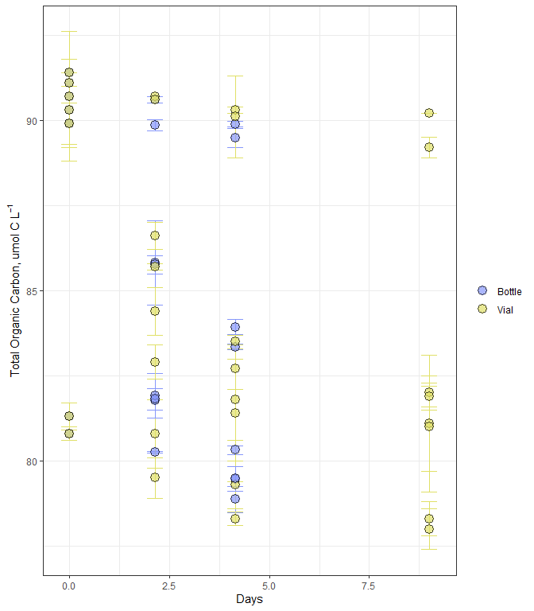
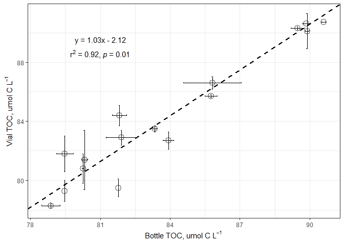
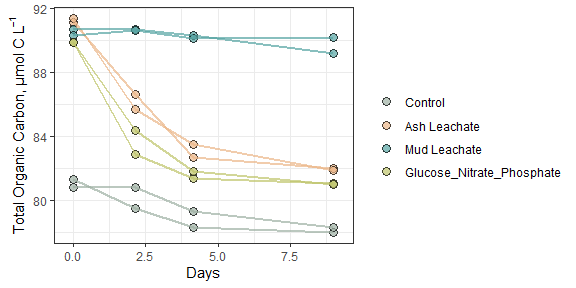
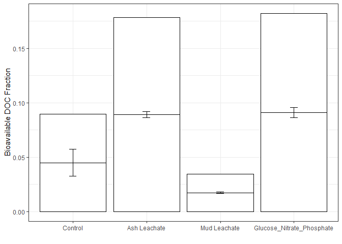
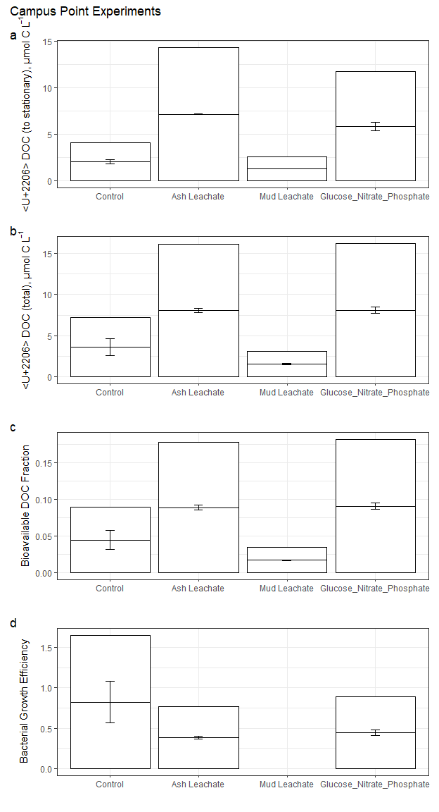

Oceana TOC Code
================
Oceana Tavasieff
11/5/2020

# Intro

In which data on individual bottle TOC/DOC data from ACIDD
remineralization experiments were processed, quality controlled, and
analyzed.

``` r
library(tidyverse)
library(readxl)
library(lubridate)
library(lmodel2)
library(zoo)
library(patchwork)
```

# Import data

``` r
excel_sheets("~/Documents/github_144l/144l_students/Input_Data/week4/144L_2018_Exp_TOC.xlsx")
```

    ## [1] "Metadata" "Data"

``` r
metadata <- read_excel("~/Documents/github_144l/144l_students/Input_Data/week4/144L_2018_Exp_TOC.xlsx", sheet = "Metadata")

data <- read_excel("~/Documents/github_144l/144l_students/Input_Data/week4/144L_2018_Exp_TOC.xlsx", sheet = "Data")
```

``` r
glimpse(metadata)
```

    ## Rows: 80
    ## Columns: 16
    ## $ Experiment           <chr> "144L_2018", "144L_2018", "144L_2018", "144L_2...
    ## $ Location             <chr> "Campus Point", "Campus Point", "Campus Point"...
    ## $ Temperature          <dbl> 20, 20, 20, 20, 20, 20, 20, 20, 20, 20, 20, 20...
    ## $ Depth                <dbl> 1, 1, 1, 1, 1, 1, 1, 1, 1, 1, 1, 1, 1, 1, 1, 1...
    ## $ Bottle               <chr> "A", "A", "A", "A", "A", "A", "A", "A", "A", "...
    ## $ Timepoint            <dbl> 0, 1, 2, 3, 4, 5, 6, 7, 8, 9, 0, 1, 2, 3, 4, 5...
    ## $ Treatment            <chr> "Control", "Control", "Control", "Control", "C...
    ## $ Target_DOC_Amendment <dbl> 0, 0, 0, 0, 0, 0, 0, 0, 0, 0, 0, 0, 0, 0, 0, 0...
    ## $ Inoculum_L           <dbl> 1.5, 1.5, 1.5, 1.5, 1.5, 1.5, 1.5, 1.5, 1.5, 1...
    ## $ Media_L              <dbl> 3.5, 3.5, 3.5, 3.5, 3.5, 3.5, 3.5, 3.5, 3.5, 3...
    ## $ Datetime             <chr> "2018-10-15T16:30", "2018-10-16T08:00", "2018-...
    ## $ TOC_Sample           <lgl> TRUE, FALSE, FALSE, FALSE, TRUE, FALSE, FALSE,...
    ## $ Parallel_Sample      <lgl> TRUE, FALSE, FALSE, FALSE, TRUE, FALSE, FALSE,...
    ## $ Cell_Sample          <lgl> TRUE, TRUE, TRUE, TRUE, TRUE, TRUE, TRUE, TRUE...
    ## $ DNA_Sample           <lgl> TRUE, FALSE, FALSE, FALSE, TRUE, FALSE, FALSE,...
    ## $ DNA_SampleID         <chr> "144_A0_S6", NA, NA, NA, "144_A4_S7", NA, NA, ...

``` r
head(metadata)
```

    ## # A tibble: 6 x 16
    ##   Experiment Location Temperature Depth Bottle Timepoint Treatment
    ##   <chr>      <chr>          <dbl> <dbl> <chr>      <dbl> <chr>    
    ## 1 144L_2018  Campus ~          20     1 A              0 Control  
    ## 2 144L_2018  Campus ~          20     1 A              1 Control  
    ## 3 144L_2018  Campus ~          20     1 A              2 Control  
    ## 4 144L_2018  Campus ~          20     1 A              3 Control  
    ## 5 144L_2018  Campus ~          20     1 A              4 Control  
    ## 6 144L_2018  Campus ~          20     1 A              5 Control  
    ## # ... with 9 more variables: Target_DOC_Amendment <dbl>, Inoculum_L <dbl>,
    ## #   Media_L <dbl>, Datetime <chr>, TOC_Sample <lgl>, Parallel_Sample <lgl>,
    ## #   Cell_Sample <lgl>, DNA_Sample <lgl>, DNA_SampleID <chr>

``` r
unique(metadata$Experiment) #all same Experiment
```

    ## [1] "144L_2018"

``` r
unique(metadata$Location) # all Campus Point
```

    ## [1] "Campus Point"

``` r
unique(metadata$Treatment) #[1] "Control","Ash Leachate", "Mud Leachate", "Glucose_Nitrate_Phosphate"
```

    ## [1] "Control"                   "Ash Leachate"             
    ## [3] "Mud Leachate"              "Glucose_Nitrate_Phosphate"

``` r
unique(metadata$Bottle) # A-H
```

    ## [1] "A" "B" "C" "D" "E" "F" "G" "H"

``` r
glimpse(data)
```

    ## Rows: 32
    ## Columns: 6
    ## $ Bottle    <chr> "A", "A", "A", "A", "B", "B", "B", "B", "C", "C", "C", "C...
    ## $ Timepoint <dbl> 0, 4, 8, 9, 0, 4, 8, 9, 0, 4, 8, 9, 0, 4, 8, 9, 0, 4, 8, ...
    ## $ TOC       <dbl> 81.30000, 81.77997, 78.87473, NA, 80.80000, 80.25890, 79....
    ## $ TOC_sd    <dbl> 0.40000000, NA, 0.38725049, NA, 0.20000000, 0.03069669, N...
    ## $ PTOC      <dbl> 81.3, 79.5, 78.3, 78.0, 80.8, 80.8, 79.3, 78.3, 91.1, 86....
    ## $ PTOC_sd   <dbl> 0.4, 0.6, 0.2, 0.6, 0.2, 1.0, 0.7, 0.5, NA, 0.4, 0.6, 0.5...

# Prepare data

``` r
joined <- left_join(metadata, data)
```

    ## Joining, by = c("Bottle", "Timepoint")

``` r
toc <- joined %>% 
  mutate(Datetime = ymd_hm(Datetime)) %>% 
  group_by(Experiment, Bottle) %>% 
  mutate(interv = interval(first(Datetime), Datetime),
         hours = interv/3600,
         days = hours/24) %>% 
  ungroup() %>% 
  rename(sd_TOC = TOC_sd,
        sd_PTOC = PTOC_sd) %>% 
  select(Experiment:Datetime, hours, days, everything(), -interv) #this last line reorders the columns st hrs and dys after datetime
```

``` r
glimpse(toc)
```

    ## Rows: 80
    ## Columns: 22
    ## $ Experiment           <chr> "144L_2018", "144L_2018", "144L_2018", "144L_2...
    ## $ Location             <chr> "Campus Point", "Campus Point", "Campus Point"...
    ## $ Temperature          <dbl> 20, 20, 20, 20, 20, 20, 20, 20, 20, 20, 20, 20...
    ## $ Depth                <dbl> 1, 1, 1, 1, 1, 1, 1, 1, 1, 1, 1, 1, 1, 1, 1, 1...
    ## $ Bottle               <chr> "A", "A", "A", "A", "A", "A", "A", "A", "A", "...
    ## $ Timepoint            <dbl> 0, 1, 2, 3, 4, 5, 6, 7, 8, 9, 0, 1, 2, 3, 4, 5...
    ## $ Treatment            <chr> "Control", "Control", "Control", "Control", "C...
    ## $ Target_DOC_Amendment <dbl> 0, 0, 0, 0, 0, 0, 0, 0, 0, 0, 0, 0, 0, 0, 0, 0...
    ## $ Inoculum_L           <dbl> 1.5, 1.5, 1.5, 1.5, 1.5, 1.5, 1.5, 1.5, 1.5, 1...
    ## $ Media_L              <dbl> 3.5, 3.5, 3.5, 3.5, 3.5, 3.5, 3.5, 3.5, 3.5, 3...
    ## $ Datetime             <dttm> 2018-10-15 16:30:00, 2018-10-16 08:00:00, 201...
    ## $ hours                <Interval> 2018-10-15 16:30:00 UTC--2018-10-15 16:30...
    ## $ days                 <Interval> 2018-10-15 16:30:00 UTC--2018-10-15 16:30...
    ## $ TOC_Sample           <lgl> TRUE, FALSE, FALSE, FALSE, TRUE, FALSE, FALSE,...
    ## $ Parallel_Sample      <lgl> TRUE, FALSE, FALSE, FALSE, TRUE, FALSE, FALSE,...
    ## $ Cell_Sample          <lgl> TRUE, TRUE, TRUE, TRUE, TRUE, TRUE, TRUE, TRUE...
    ## $ DNA_Sample           <lgl> TRUE, FALSE, FALSE, FALSE, TRUE, FALSE, FALSE,...
    ## $ DNA_SampleID         <chr> "144_A0_S6", NA, NA, NA, "144_A4_S7", NA, NA, ...
    ## $ TOC                  <dbl> 81.30000, NA, NA, NA, 81.77997, NA, NA, NA, 78...
    ## $ sd_TOC               <dbl> 0.40000000, NA, NA, NA, NA, NA, NA, NA, 0.3872...
    ## $ PTOC                 <dbl> 81.3, NA, NA, NA, 79.5, NA, NA, NA, 78.3, 78.0...
    ## $ sd_PTOC              <dbl> 0.4, NA, NA, NA, 0.6, NA, NA, NA, 0.2, 0.6, 0....

# Plot the curves

## Pivot data

``` r
pivot_toc <- toc %>% 
  select(Experiment, Location, Bottle, Treatment, days, TOC, PTOC) %>% 
  pivot_longer(TOC:PTOC, names_to = "sample", values_to = "value") #pivot longer makes more rows fewer columns. values in "sample" heading will be TOC or PTOC (actually TOC through PTOC)
#makes ggplot easier so we can have as factor

pivot_toc_sd <- toc %>% 
    select(Experiment, Location, Bottle, Treatment, days, sd_TOC, sd_PTOC) %>% 
  pivot_longer(sd_TOC:sd_PTOC, names_to = "sample", names_prefix = "sd_", values_to = "sd") #remove sd_ prefix to allow merging

pivoted <- left_join(pivot_toc, pivot_toc_sd) %>% 
  mutate(sample = ifelse(sample == "TOC", "Bottle", "Vial")) # If character in sample is TOC, replace with bottle. Otherwise, replace [PTOC] with Vial
```

    ## Joining, by = c("Experiment", "Location", "Bottle", "Treatment", "days", "sample")

``` r
glimpse(pivoted)
```

    ## Rows: 160
    ## Columns: 8
    ## $ Experiment <chr> "144L_2018", "144L_2018", "144L_2018", "144L_2018", "144...
    ## $ Location   <chr> "Campus Point", "Campus Point", "Campus Point", "Campus ...
    ## $ Bottle     <chr> "A", "A", "A", "A", "A", "A", "A", "A", "A", "A", "A", "...
    ## $ Treatment  <chr> "Control", "Control", "Control", "Control", "Control", "...
    ## $ days       <Interval> 2018-10-15 16:30:00 UTC--2018-10-15 16:30:00 UTC, 2...
    ## $ sample     <chr> "Bottle", "Vial", "Bottle", "Vial", "Bottle", "Vial", "B...
    ## $ value      <dbl> 81.30000, 81.30000, NA, NA, NA, NA, NA, NA, 81.77997, 79...
    ## $ sd         <dbl> 0.4000000, 0.4000000, NA, NA, NA, NA, NA, NA, NA, 0.6000...

## Plot

``` r
custom.colors <- c("Control" = "#9eb0a3", "Ash Leachate" = "#ebb688", "Mud Leachate" = "#55a3a2", "Glucose_Nitrate_Phosphate" = "#bec46a", "Vial" = "#e0e067", "Bottle" = "#8797fa" )
levels <- c("Control", "Ash Leachate", "Mud Leachate", "Glucose_Nitrate_Phosphate", "Bottle", "Vial")


pivoted %>% 
  drop_na(value) %>% 
  mutate(Treatment = factor(Treatment, levels = levels),
         sample = factor(sample, levels = levels)) %>% 
  ggplot(aes(x = days, y = value, group = interaction(Treatment, Bottle))) +
  geom_errorbar(aes(ymin = value - sd, ymax = value + sd, color = sample), width = 0.4) +
  geom_point(aes(fill = sample), size = 4, shape = 21, alpha = 0.7) +
  scale_color_manual(values = custom.colors) +
  scale_fill_manual(values = custom.colors) +
  labs(x = "Days", y = expression("Total Organic Carbon, umol C L"^-1), color = "", fill = "") +
  theme_bw() +
  #facet_grid(rows = "Treatment", scales = "free") +
  guides(color = F) #removes line in legend
```

<!-- --> The
analytical detection limit (the sensitivity of our methods) for our TOC
analysis is -1.5 umol C L<sup>-1</sup>.

\#TOC v PTOC (bottle vs. vial)

Using the Model II regression (both x and y variables are not
independent, neither are controlled, both are measured).

``` r
reg.data <- toc %>% 
  drop_na(TOC) %>% 
  filter(Timepoint > 0)

reg <- lmodel2(PTOC ~ TOC, data = reg.data, nperm = 99) # y ~ x (determines axes. nperm = number permutations = no. times model is run)
```

    ## RMA was not requested: it will not be computed.

``` r
#RMS was not requested:  we use SMA usually
```

``` r
reg
```

    ## 
    ## Model II regression
    ## 
    ## Call: lmodel2(formula = PTOC ~ TOC, data = reg.data, nperm = 99)
    ## 
    ## n = 16   r = 0.9604998   r-square = 0.9225598 
    ## Parametric P-values:   2-tailed = 3.623619e-09    1-tailed = 1.811809e-09 
    ## Angle between the two OLS regression lines = 2.307491 degrees
    ## 
    ## Permutation tests of OLS, MA, RMA slopes: 1-tailed, tail corresponding to sign
    ## A permutation test of r is equivalent to a permutation test of the OLS slope
    ## P-perm for SMA = NA because the SMA slope cannot be tested
    ## 
    ## Regression results
    ##   Method Intercept     Slope Angle (degrees) P-perm (1-tailed)
    ## 1    OLS  1.291392 0.9890968        44.68594              0.01
    ## 2     MA -2.226082 1.0310159        45.87490              0.01
    ## 3    SMA -2.121795 1.0297731        45.84037                NA
    ## 
    ## Confidence intervals
    ##   Method 2.5%-Intercept 97.5%-Intercept 2.5%-Slope 97.5%-Slope
    ## 1    OLS      -12.50802        15.09081  0.8248319    1.153362
    ## 2     MA      -17.99796        11.05134  0.8727838    1.218975
    ## 3    SMA      -16.99788        10.56939  0.8785273    1.207057
    ## 
    ## Eigenvalues: 34.74849 0.6994871 
    ## 
    ## H statistic used for computing C.I. of MA: 0.006888855

``` r
# pull out and save certain data as objects
# note reg is a list of 16

# This method is adaptable to changes upstream in analysis (changes as preceding method changes)

  #     Two Parameters to make line for linear regression
intercept <- reg$regression.results[3,2] #3rd value in second row of regression.results element
slope <- reg$regression.results[3,3]

# 2.5$ CI
two_int <- reg$confidence.intervals[3,2]
two_slope <- reg$confidence.intervals[3,4]

# 97.5% CI
nine_int <- reg$confidence.intervals[3,3]
nine_slope <- reg$confidence.intervals[3,5]
```

``` r
reg.data %>% 
  ggplot(aes(x =TOC, y = PTOC)) +
  geom_errorbar(aes(ymin = PTOC - sd_PTOC, ymax = PTOC + sd_PTOC), width = 0.05) + 
  geom_errorbarh(aes(xmin = TOC - sd_TOC, xmax = TOC + sd_TOC), width = 0.05) +
  geom_point(shape = 21, size =4, alpha = 0.7) +
  geom_abline(intercept = intercept, slope = slope, color = "black", linetype = 2, size = 1) +
  geom_abline(intercept = two_int, slope = two_slope, color = "black", linetype = 3, size = 1) +
  geom_abline(intercept = nine_int, slope = nine_slope, color = "black", linetype = 3, size = 1) +
  labs (x = expression("Bottle TOC, umol C L"^-1), y =  expression("Vial TOC, umol C L"^-1)) +
  theme_bw() +
  annotate( geom = "text", label = expression(atop("y = 1.03x - 2.12", paste("r"^2, " = 0.92,", italic(" p "), "= 0.01"))), x = 81, y = 89, size = 4) #This text does NOT adjust to upstream changes. x =, y =  gives location for text on graph. ATOP() says which text is on top
```

    ## Warning: Ignoring unknown parameters: width

    ## Warning: Removed 2 rows containing missing values (geom_errorbarh).

    ## Warning in is.na(x): is.na() applied to non-(list or vector) of type
    ## 'expression'

<!-- -->

``` r
bc <- read_rds("~/Documents/github_144l/144l_students/Output_Data/Week 3/ACIDD_Exp_Processed_BactAbund_rds")

merge <- left_join(toc, bc)%>%
  select(Experiment:days, TOC:sd_PTOC, cells:diff_ln_cells, bc, ave_bc, sd_bc, everything(), -c(contains("Sample"))) %>% 
  group_by(Experiment, Treatment, Bottle) %>% 
  fill(exp_start:sd_lag) %>% 
  ungroup()
```

    ## Joining, by = c("Location", "Temperature", "Depth", "Bottle", "Timepoint", "Treatment", "Target_DOC_Amendment", "Inoculum_L", "Media_L", "Datetime", "hours", "days", "TOC_Sample", "Parallel_Sample", "Cell_Sample", "DNA_Sample", "DNA_SampleID")

``` r
glimpse(merge)
```

    ## Rows: 80
    ## Columns: 48
    ## $ Experiment           <chr> "144L_2018", "144L_2018", "144L_2018", "144L_2...
    ## $ Location             <chr> "Campus Point", "Campus Point", "Campus Point"...
    ## $ Temperature          <dbl> 20, 20, 20, 20, 20, 20, 20, 20, 20, 20, 20, 20...
    ## $ Depth                <dbl> 1, 1, 1, 1, 1, 1, 1, 1, 1, 1, 1, 1, 1, 1, 1, 1...
    ## $ Bottle               <chr> "A", "A", "A", "A", "A", "A", "A", "A", "A", "...
    ## $ Timepoint            <dbl> 0, 1, 2, 3, 4, 5, 6, 7, 8, 9, 0, 1, 2, 3, 4, 5...
    ## $ Treatment            <chr> "Control", "Control", "Control", "Control", "C...
    ## $ Target_DOC_Amendment <dbl> 0, 0, 0, 0, 0, 0, 0, 0, 0, 0, 0, 0, 0, 0, 0, 0...
    ## $ Inoculum_L           <dbl> 1.5, 1.5, 1.5, 1.5, 1.5, 1.5, 1.5, 1.5, 1.5, 1...
    ## $ Media_L              <dbl> 3.5, 3.5, 3.5, 3.5, 3.5, 3.5, 3.5, 3.5, 3.5, 3...
    ## $ Datetime             <dttm> 2018-10-15 16:30:00, 2018-10-16 08:00:00, 201...
    ## $ hours                <Interval> 2018-10-15 16:30:00 UTC--2018-10-15 16:30...
    ## $ days                 <Interval> 2018-10-15 16:30:00 UTC--2018-10-15 16:30...
    ## $ TOC                  <dbl> 81.30000, NA, NA, NA, 81.77997, NA, NA, NA, 78...
    ## $ sd_TOC               <dbl> 0.40000000, NA, NA, NA, NA, NA, NA, NA, 0.3872...
    ## $ PTOC                 <dbl> 81.3, NA, NA, NA, 79.5, NA, NA, NA, 78.3, 78.0...
    ## $ sd_PTOC              <dbl> 0.4, NA, NA, NA, 0.6, NA, NA, NA, 0.2, 0.6, 0....
    ## $ cells                <dbl> 332531522, 523943125, 859019934, 906998856, 93...
    ## $ sd_cells             <dbl> NA, NA, NA, NA, NA, NA, NA, NA, NA, NA, NA, NA...
    ## $ interv               <Interval> 2018-10-15 16:30:00 UTC--2018-10-15 16:30...
    ## $ ln_cells             <dbl> 19.62225, 20.07689, 20.57130, 20.62565, 20.653...
    ## $ diff_ln_cells        <dbl> 0.000000000, 0.454648479, 0.494408990, 0.05434...
    ## $ bc                   <dbl> 0.8313288, 1.3098578, 2.1475498, 2.2674971, 2....
    ## $ ave_bc               <dbl> 0.8313288, 1.3098578, 2.1475498, 2.2674971, 2....
    ## $ sd_bc                <dbl> NA, NA, NA, NA, NA, NA, NA, NA, NA, NA, NA, NA...
    ## $ Cells_ml             <dbl> 332531.5, 523943.1, 859019.9, 906998.9, 933025...
    ## $ exp_start            <dbl> 1, 1, 1, 1, 1, 1, 1, 1, 1, 1, 1, 1, 1, 1, 1, 1...
    ## $ exp_end              <dbl> 2, 2, 2, 2, 2, 2, 2, 2, 2, 2, 4, 4, 4, 4, 4, 4...
    ## $ ln_cells_exp_start   <dbl> 20.07689, 20.07689, 20.10741, 20.10741, 20.107...
    ## $ ln_cells_exp_end     <dbl> 20.57130, 20.57130, 20.57130, 20.82448, 20.824...
    ## $ cells_exp_start      <dbl> 523943125, 523943125, 540180187, 540180187, 54...
    ## $ cells_exp_end        <dbl> 859019934, 859019934, 859019934, 1106511579, 1...
    ## $ days_exp_start       <dbl> 0.6458333, 0.6458333, 0.6458333, 0.6458333, 0....
    ## $ days_exp_end         <dbl> 1.145833, 1.145833, 1.145833, 2.145833, 2.1458...
    ## $ mew                  <dbl> 0.9888180, 0.9888180, 0.9277787, 0.4780432, 0....
    ## $ doubling             <dbl> 0.7009856, 0.7009856, 0.7471040, 1.4499675, 1....
    ## $ delta_cells          <dbl> 526488412, 526488412, 526488412, 773980057, 77...
    ## $ delta_bc             <dbl> 1.316221, 1.316221, 1.316221, 1.934950, 1.9349...
    ## $ ave_mew              <dbl> 0.6415193, 0.6415193, 0.6415193, 0.6415193, 0....
    ## $ sd_mew               <dbl> 0.24584643, 0.24584643, 0.24584643, 0.24584643...
    ## $ ave_doubling         <dbl> 1.205431, 1.205431, 1.205431, 1.205431, 1.2054...
    ## $ sd_doubling          <dbl> 0.3670461, 0.3670461, 0.3670461, 0.3670461, 0....
    ## $ ave_delta_cells      <dbl> 691482842, 691482842, 691482842, 691482842, 69...
    ## $ sd_delta_cells       <dbl> 123745822, 123745822, 123745822, 123745822, 12...
    ## $ ave_delta_bc         <dbl> 1.728707, 1.728707, 1.728707, 1.728707, 1.7287...
    ## $ sd_delta_bc          <dbl> 0.3093646, 0.3093646, 0.3093646, 0.3093646, 0....
    ## $ ave_lag              <dbl> 0.6458333, 0.6458333, 0.6458333, 0.6458333, 0....
    ## $ sd_lag               <dbl> 0.0000000, 0.0000000, 0.0000000, 0.0000000, 0....

# Interpolate

Interpolate only w/in an experiment, not across experiments. We will
apply interpolation by using the split-apply-combine strategy.

Split our dataframe into a list of its elements, apply our interpolation
function to each list element then recombine into new dataframe.

``` r
to_interpolate <- merge %>% 
  select(Treatment, Bottle, Timepoint, days, PTOC, bc) %>% 
  group_by(Treatment, Bottle)

list <- to_interpolate %>% 
  group_split() #to convert df to list

keys <- to_interpolate %>% 
  group_keys() %>% 
  mutate(key = paste(Bottle)) #add names to list elements

names(list) <- keys$key #set names created in above lines to be names in list
```

## Write function

``` r
#?na.approx
#cbind = column bind
interp.func <- function(x) {
  y <- zoo(x, order.by = x$days) # orders our observations
  interp_toc <- round(as.numeric(na.approx(y$PTOC, na.rm = F)), 1) # interpolates toc
  interp_bc <- round(as.numeric(na.approx(y$bc, na.rm = F)), 1)
  z <- cbind(y, interp_toc, interp_bc) #combines the columns
  as_tibble(z) #convert to dataframe
}
```

## Apply and Combine

``` r
interpolated <- lapply(list, interp.func) %>% 
  plyr::ldply(., as.data.frame) %>% 
  select(-c(.id, PTOC, bc, days)) %>% 
  mutate_at(vars(Timepoint:interp_bc), as.numeric) %>% 
  left_join(merge, .)
```

    ## Joining, by = c("Bottle", "Timepoint", "Treatment")

``` r
glimpse(interpolated)
```

    ## Rows: 80
    ## Columns: 50
    ## $ Experiment           <chr> "144L_2018", "144L_2018", "144L_2018", "144L_2...
    ## $ Location             <chr> "Campus Point", "Campus Point", "Campus Point"...
    ## $ Temperature          <dbl> 20, 20, 20, 20, 20, 20, 20, 20, 20, 20, 20, 20...
    ## $ Depth                <dbl> 1, 1, 1, 1, 1, 1, 1, 1, 1, 1, 1, 1, 1, 1, 1, 1...
    ## $ Bottle               <chr> "A", "A", "A", "A", "A", "A", "A", "A", "A", "...
    ## $ Timepoint            <dbl> 0, 1, 2, 3, 4, 5, 6, 7, 8, 9, 0, 1, 2, 3, 4, 5...
    ## $ Treatment            <chr> "Control", "Control", "Control", "Control", "C...
    ## $ Target_DOC_Amendment <dbl> 0, 0, 0, 0, 0, 0, 0, 0, 0, 0, 0, 0, 0, 0, 0, 0...
    ## $ Inoculum_L           <dbl> 1.5, 1.5, 1.5, 1.5, 1.5, 1.5, 1.5, 1.5, 1.5, 1...
    ## $ Media_L              <dbl> 3.5, 3.5, 3.5, 3.5, 3.5, 3.5, 3.5, 3.5, 3.5, 3...
    ## $ Datetime             <dttm> 2018-10-15 16:30:00, 2018-10-16 08:00:00, 201...
    ## $ hours                <Interval> 2018-10-15 16:30:00 UTC--2018-10-15 16:30...
    ## $ days                 <Interval> 2018-10-15 16:30:00 UTC--2018-10-15 16:30...
    ## $ TOC                  <dbl> 81.30000, NA, NA, NA, 81.77997, NA, NA, NA, 78...
    ## $ sd_TOC               <dbl> 0.40000000, NA, NA, NA, NA, NA, NA, NA, 0.3872...
    ## $ PTOC                 <dbl> 81.3, NA, NA, NA, 79.5, NA, NA, NA, 78.3, 78.0...
    ## $ sd_PTOC              <dbl> 0.4, NA, NA, NA, 0.6, NA, NA, NA, 0.2, 0.6, 0....
    ## $ cells                <dbl> 332531522, 523943125, 859019934, 906998856, 93...
    ## $ sd_cells             <dbl> NA, NA, NA, NA, NA, NA, NA, NA, NA, NA, NA, NA...
    ## $ interv               <Interval> 2018-10-15 16:30:00 UTC--2018-10-15 16:30...
    ## $ ln_cells             <dbl> 19.62225, 20.07689, 20.57130, 20.62565, 20.653...
    ## $ diff_ln_cells        <dbl> 0.000000000, 0.454648479, 0.494408990, 0.05434...
    ## $ bc                   <dbl> 0.8313288, 1.3098578, 2.1475498, 2.2674971, 2....
    ## $ ave_bc               <dbl> 0.8313288, 1.3098578, 2.1475498, 2.2674971, 2....
    ## $ sd_bc                <dbl> NA, NA, NA, NA, NA, NA, NA, NA, NA, NA, NA, NA...
    ## $ Cells_ml             <dbl> 332531.5, 523943.1, 859019.9, 906998.9, 933025...
    ## $ exp_start            <dbl> 1, 1, 1, 1, 1, 1, 1, 1, 1, 1, 1, 1, 1, 1, 1, 1...
    ## $ exp_end              <dbl> 2, 2, 2, 2, 2, 2, 2, 2, 2, 2, 4, 4, 4, 4, 4, 4...
    ## $ ln_cells_exp_start   <dbl> 20.07689, 20.07689, 20.10741, 20.10741, 20.107...
    ## $ ln_cells_exp_end     <dbl> 20.57130, 20.57130, 20.57130, 20.82448, 20.824...
    ## $ cells_exp_start      <dbl> 523943125, 523943125, 540180187, 540180187, 54...
    ## $ cells_exp_end        <dbl> 859019934, 859019934, 859019934, 1106511579, 1...
    ## $ days_exp_start       <dbl> 0.6458333, 0.6458333, 0.6458333, 0.6458333, 0....
    ## $ days_exp_end         <dbl> 1.145833, 1.145833, 1.145833, 2.145833, 2.1458...
    ## $ mew                  <dbl> 0.9888180, 0.9888180, 0.9277787, 0.4780432, 0....
    ## $ doubling             <dbl> 0.7009856, 0.7009856, 0.7471040, 1.4499675, 1....
    ## $ delta_cells          <dbl> 526488412, 526488412, 526488412, 773980057, 77...
    ## $ delta_bc             <dbl> 1.316221, 1.316221, 1.316221, 1.934950, 1.9349...
    ## $ ave_mew              <dbl> 0.6415193, 0.6415193, 0.6415193, 0.6415193, 0....
    ## $ sd_mew               <dbl> 0.24584643, 0.24584643, 0.24584643, 0.24584643...
    ## $ ave_doubling         <dbl> 1.205431, 1.205431, 1.205431, 1.205431, 1.2054...
    ## $ sd_doubling          <dbl> 0.3670461, 0.3670461, 0.3670461, 0.3670461, 0....
    ## $ ave_delta_cells      <dbl> 691482842, 691482842, 691482842, 691482842, 69...
    ## $ sd_delta_cells       <dbl> 123745822, 123745822, 123745822, 123745822, 12...
    ## $ ave_delta_bc         <dbl> 1.728707, 1.728707, 1.728707, 1.728707, 1.7287...
    ## $ sd_delta_bc          <dbl> 0.3093646, 0.3093646, 0.3093646, 0.3093646, 0....
    ## $ ave_lag              <dbl> 0.6458333, 0.6458333, 0.6458333, 0.6458333, 0....
    ## $ sd_lag               <dbl> 0.0000000, 0.0000000, 0.0000000, 0.0000000, 0....
    ## $ interp_toc           <dbl> 81.3, 80.8, 80.3, 79.9, 79.5, 79.2, 78.9, 78.6...
    ## $ interp_bc            <dbl> 0.8, 1.3, 2.1, 2.3, 2.3, 2.2, 2.0, 2.0, 2.4, N...

# Estimate DOC, Bioavailability, BGEs

``` r
doc <- interpolated %>% 
  mutate(doc = interp_toc - interp_bc) %>% 
  group_by(Treatment, Bottle) %>% 
  mutate(bioav_doc = (first(doc) - last(na.omit(doc))) / first(doc), 
         doc_exp_end = ifelse(Timepoint == exp_end, doc, NA),
         delta_doc = first(doc) - doc_exp_end, 
         tdelta_doc = first(doc) - last(na.omit(doc)),
         bge = ifelse(delta_doc > 1.5, delta_bc/delta_doc, NA)) %>% 
  fill(doc_exp_end:bge, .direction = "downup") %>% 
  ungroup()
glimpse(doc)
```

    ## Rows: 80
    ## Columns: 56
    ## $ Experiment           <chr> "144L_2018", "144L_2018", "144L_2018", "144L_2...
    ## $ Location             <chr> "Campus Point", "Campus Point", "Campus Point"...
    ## $ Temperature          <dbl> 20, 20, 20, 20, 20, 20, 20, 20, 20, 20, 20, 20...
    ## $ Depth                <dbl> 1, 1, 1, 1, 1, 1, 1, 1, 1, 1, 1, 1, 1, 1, 1, 1...
    ## $ Bottle               <chr> "A", "A", "A", "A", "A", "A", "A", "A", "A", "...
    ## $ Timepoint            <dbl> 0, 1, 2, 3, 4, 5, 6, 7, 8, 9, 0, 1, 2, 3, 4, 5...
    ## $ Treatment            <chr> "Control", "Control", "Control", "Control", "C...
    ## $ Target_DOC_Amendment <dbl> 0, 0, 0, 0, 0, 0, 0, 0, 0, 0, 0, 0, 0, 0, 0, 0...
    ## $ Inoculum_L           <dbl> 1.5, 1.5, 1.5, 1.5, 1.5, 1.5, 1.5, 1.5, 1.5, 1...
    ## $ Media_L              <dbl> 3.5, 3.5, 3.5, 3.5, 3.5, 3.5, 3.5, 3.5, 3.5, 3...
    ## $ Datetime             <dttm> 2018-10-15 16:30:00, 2018-10-16 08:00:00, 201...
    ## $ hours                <Interval> 2018-10-15 16:30:00 UTC--2018-10-15 16:30...
    ## $ days                 <Interval> 2018-10-15 16:30:00 UTC--2018-10-15 16:30...
    ## $ TOC                  <dbl> 81.30000, NA, NA, NA, 81.77997, NA, NA, NA, 78...
    ## $ sd_TOC               <dbl> 0.40000000, NA, NA, NA, NA, NA, NA, NA, 0.3872...
    ## $ PTOC                 <dbl> 81.3, NA, NA, NA, 79.5, NA, NA, NA, 78.3, 78.0...
    ## $ sd_PTOC              <dbl> 0.4, NA, NA, NA, 0.6, NA, NA, NA, 0.2, 0.6, 0....
    ## $ cells                <dbl> 332531522, 523943125, 859019934, 906998856, 93...
    ## $ sd_cells             <dbl> NA, NA, NA, NA, NA, NA, NA, NA, NA, NA, NA, NA...
    ## $ interv               <Interval> 2018-10-15 16:30:00 UTC--2018-10-15 16:30...
    ## $ ln_cells             <dbl> 19.62225, 20.07689, 20.57130, 20.62565, 20.653...
    ## $ diff_ln_cells        <dbl> 0.000000000, 0.454648479, 0.494408990, 0.05434...
    ## $ bc                   <dbl> 0.8313288, 1.3098578, 2.1475498, 2.2674971, 2....
    ## $ ave_bc               <dbl> 0.8313288, 1.3098578, 2.1475498, 2.2674971, 2....
    ## $ sd_bc                <dbl> NA, NA, NA, NA, NA, NA, NA, NA, NA, NA, NA, NA...
    ## $ Cells_ml             <dbl> 332531.5, 523943.1, 859019.9, 906998.9, 933025...
    ## $ exp_start            <dbl> 1, 1, 1, 1, 1, 1, 1, 1, 1, 1, 1, 1, 1, 1, 1, 1...
    ## $ exp_end              <dbl> 2, 2, 2, 2, 2, 2, 2, 2, 2, 2, 4, 4, 4, 4, 4, 4...
    ## $ ln_cells_exp_start   <dbl> 20.07689, 20.07689, 20.10741, 20.10741, 20.107...
    ## $ ln_cells_exp_end     <dbl> 20.57130, 20.57130, 20.57130, 20.82448, 20.824...
    ## $ cells_exp_start      <dbl> 523943125, 523943125, 540180187, 540180187, 54...
    ## $ cells_exp_end        <dbl> 859019934, 859019934, 859019934, 1106511579, 1...
    ## $ days_exp_start       <dbl> 0.6458333, 0.6458333, 0.6458333, 0.6458333, 0....
    ## $ days_exp_end         <dbl> 1.145833, 1.145833, 1.145833, 2.145833, 2.1458...
    ## $ mew                  <dbl> 0.9888180, 0.9888180, 0.9277787, 0.4780432, 0....
    ## $ doubling             <dbl> 0.7009856, 0.7009856, 0.7471040, 1.4499675, 1....
    ## $ delta_cells          <dbl> 526488412, 526488412, 526488412, 773980057, 77...
    ## $ delta_bc             <dbl> 1.316221, 1.316221, 1.316221, 1.934950, 1.9349...
    ## $ ave_mew              <dbl> 0.6415193, 0.6415193, 0.6415193, 0.6415193, 0....
    ## $ sd_mew               <dbl> 0.24584643, 0.24584643, 0.24584643, 0.24584643...
    ## $ ave_doubling         <dbl> 1.205431, 1.205431, 1.205431, 1.205431, 1.2054...
    ## $ sd_doubling          <dbl> 0.3670461, 0.3670461, 0.3670461, 0.3670461, 0....
    ## $ ave_delta_cells      <dbl> 691482842, 691482842, 691482842, 691482842, 69...
    ## $ sd_delta_cells       <dbl> 123745822, 123745822, 123745822, 123745822, 12...
    ## $ ave_delta_bc         <dbl> 1.728707, 1.728707, 1.728707, 1.728707, 1.7287...
    ## $ sd_delta_bc          <dbl> 0.3093646, 0.3093646, 0.3093646, 0.3093646, 0....
    ## $ ave_lag              <dbl> 0.6458333, 0.6458333, 0.6458333, 0.6458333, 0....
    ## $ sd_lag               <dbl> 0.0000000, 0.0000000, 0.0000000, 0.0000000, 0....
    ## $ interp_toc           <dbl> 81.3, 80.8, 80.3, 79.9, 79.5, 79.2, 78.9, 78.6...
    ## $ interp_bc            <dbl> 0.8, 1.3, 2.1, 2.3, 2.3, 2.2, 2.0, 2.0, 2.4, N...
    ## $ doc                  <dbl> 80.5, 79.5, 78.2, 77.6, 77.2, 77.0, 76.9, 76.6...
    ## $ bioav_doc            <dbl> 0.05714286, 0.05714286, 0.05714286, 0.05714286...
    ## $ doc_exp_end          <dbl> 78.2, 78.2, 78.2, 78.2, 78.2, 78.2, 78.2, 78.2...
    ## $ delta_doc            <dbl> 2.3, 2.3, 2.3, 2.3, 2.3, 2.3, 2.3, 2.3, 2.3, 2...
    ## $ tdelta_doc           <dbl> 4.6, 4.6, 4.6, 4.6, 4.6, 4.6, 4.6, 4.6, 4.6, 4...
    ## $ bge                  <dbl> 0.5722700, 0.5722700, 0.5722700, 0.5722700, 0....

# Treatment averages

``` r
averages <- doc %>% 
  group_by(Treatment, Bottle, Timepoint) %>% 
  mutate(ave_toc = mean(PTOC),
         sd_toc = sd(PTOC)) %>% 
  ungroup() %>% 
  group_by(Treatment) %>% 
  mutate(ave_bioav_doc = mean(bioav_doc),
         sd_bioav_doc = sd(bioav_doc),
         ave_delta_doc = mean(delta_doc),
         sd_delta_doc = sd(delta_doc),
         ave_tdelta_doc = mean(tdelta_doc),
         sd_tdelta_doc = sd(tdelta_doc),
         ave_bge = mean(bge),
         sd_bge = sd(bge)) %>% 
  ungroup()
```

``` r
subset <- averages %>% 
  select(Treatment, Bottle, Timepoint, PTOC, ave_toc:sd_bge)
glimpse(subset)
```

    ## Rows: 80
    ## Columns: 14
    ## $ Treatment      <chr> "Control", "Control", "Control", "Control", "Control...
    ## $ Bottle         <chr> "A", "A", "A", "A", "A", "A", "A", "A", "A", "A", "B...
    ## $ Timepoint      <dbl> 0, 1, 2, 3, 4, 5, 6, 7, 8, 9, 0, 1, 2, 3, 4, 5, 6, 7...
    ## $ PTOC           <dbl> 81.3, NA, NA, NA, 79.5, NA, NA, NA, 78.3, 78.0, 80.8...
    ## $ ave_toc        <dbl> 81.3, NA, NA, NA, 79.5, NA, NA, NA, 78.3, 78.0, 80.8...
    ## $ sd_toc         <dbl> NA, NA, NA, NA, NA, NA, NA, NA, NA, NA, NA, NA, NA, ...
    ## $ ave_bioav_doc  <dbl> 0.04486216, 0.04486216, 0.04486216, 0.04486216, 0.04...
    ## $ sd_bioav_doc   <dbl> 0.012599734, 0.012599734, 0.012599734, 0.012599734, ...
    ## $ ave_delta_doc  <dbl> 2.05, 2.05, 2.05, 2.05, 2.05, 2.05, 2.05, 2.05, 2.05...
    ## $ sd_delta_doc   <dbl> 0.25649459, 0.25649459, 0.25649459, 0.25649459, 0.25...
    ## $ ave_tdelta_doc <dbl> 3.60, 3.60, 3.60, 3.60, 3.60, 3.60, 3.60, 3.60, 3.60...
    ## $ sd_tdelta_doc  <dbl> 1.0259784, 1.0259784, 1.0259784, 1.0259784, 1.025978...
    ## $ ave_bge        <dbl> 0.8236212, 0.8236212, 0.8236212, 0.8236212, 0.823621...
    ## $ sd_bge         <dbl> 0.25788083, 0.25788083, 0.25788083, 0.25788083, 0.25...

# Plot treatment curves (TOC)

``` r
averages %>% 
  mutate(Treatment = factor(Treatment, levels = levels)) %>% 
  drop_na(ave_toc) %>% 
  ggplot(aes(x = days, y = ave_toc, group = interaction(Bottle, Treatment))) +
  geom_errorbar(aes(ymin = ave_toc - sd_toc, ymax = ave_toc + sd_toc, color = Treatment), width = 0.4) +
  geom_point(aes(fill = Treatment), size = 3, shape = 21, alpha = 0.7) +
  geom_line(aes(color = Treatment), size = 1, alpha = 0.7) +
  scale_color_manual(values = custom.colors) +
  scale_fill_manual(values = custom.colors) +
  labs(x = "Days", y = expression("Total Organic Carbon, µmol C L"^-1), color = "", fill = "") +
  theme_bw() +
#facet_grid(rows = "Treatment", scales = "free") + 
  guides(color = F)
```

<!-- -->

# Plot treatment averages (bars)

``` r
bar.data <- averages %>% 
  select(Bottle, Treatment, ave_bioav_doc:sd_bge) %>% 
  distinct()
  
bar.data
```

    ## # A tibble: 8 x 10
    ##   Bottle Treatment ave_bioav_doc sd_bioav_doc ave_delta_doc sd_delta_doc
    ##   <chr>  <chr>             <dbl>        <dbl>         <dbl>        <dbl>
    ## 1 A      Control          0.0449     0.0126            2.05       0.256 
    ## 2 B      Control          0.0449     0.0126            2.05       0.256 
    ## 3 C      Ash Leac~        0.0891     0.00294           7.15       0.0513
    ## 4 D      Ash Leac~        0.0891     0.00294           7.15       0.0513
    ## 5 E      Mud Leac~        0.0173     0.000543          1.30       0     
    ## 6 F      Mud Leac~        0.0173     0.000543          1.30       0     
    ## 7 G      Glucose_~        0.0910     0.00456           5.85       0.462 
    ## 8 H      Glucose_~        0.0910     0.00456           5.85       0.462 
    ## # ... with 4 more variables: ave_tdelta_doc <dbl>, sd_tdelta_doc <dbl>,
    ## #   ave_bge <dbl>, sd_bge <dbl>

``` r
bioav <- bar.data %>% 
ggplot(aes(x = factor(Treatment, levels = levels), y =  ave_bioav_doc, group = interaction(Bottle, Treatment)))  + 
  geom_col( color = "black", fill = "white", alpha = 1) +
  geom_errorbar(aes(ymin = ave_bioav_doc - sd_bioav_doc, ymax = ave_bioav_doc + sd_bioav_doc), width = 0.1, size = 0.5) +
  labs(x = "", y = expression(paste("Bioavailable DOC Fraction")), color = "") +
  theme_bw() 
  #facet_grid(~factor(Bottle, levels = levels), scales = "free") 
bioav
```

<!-- -->

``` r
deldoc <- bar.data %>% 
ggplot(aes(x = factor(Treatment, levels = levels), y =  ave_delta_doc, group = interaction(Bottle, Treatment)))  + 
  geom_col(color = "black", fill = "white", alpha = 1) +
  geom_errorbar(aes(ymin = ave_delta_doc - sd_delta_doc, ymax = ave_delta_doc + sd_delta_doc), width = 0.1, size = 0.5) +
  labs(x = "", y = expression(paste("∆ DOC (to stationary), µmol C L"^-1)), color = "") +
  theme_bw() +
  #facet_grid(~factor(Location, levels = levels), scales = "free") +
  guides(fill = F) 
```

``` r
total_deldoc <- bar.data %>% 
ggplot(aes(x = factor(Treatment, levels = levels), y =  ave_tdelta_doc, group = interaction(Bottle, Treatment)))  + 
  geom_col(color = "black", fill = "white", alpha = 1) +
  geom_errorbar(aes(ymin = ave_tdelta_doc - sd_tdelta_doc, ymax = ave_tdelta_doc + sd_tdelta_doc), width = 0.1, size = 0.5) +
  labs(x = "", y = expression(paste("∆ DOC (total), µmol C L"^-1)), color = "") +
  theme_bw() +
  #facet_grid(~factor(Location, levels = levels), scales = "free") +
  guides(fill = F) 
```

``` r
bge <- bar.data %>% 
ggplot(aes(x = factor(Treatment, levels = levels), y =  ave_bge, group = interaction(Bottle, Treatment)))  + 
  geom_col(color = "black", fill = "white", alpha = 1) +
  geom_errorbar(aes(ymin = ave_bge - sd_bge, ymax = ave_bge + sd_bge), width = 0.1, size = 0.5) +
  labs(x = "", y = expression(paste("Bacterial Growth Efficiency")), color = "") +
  theme_bw() +
  #facet_grid(~factor(Location, levels = levels), scales = "free") +
  guides(fill = F) 
```

``` r
deldoc / total_deldoc / bioav / bge + plot_annotation(title = "Campus Point Experiments", tag_levels = "a")
```

    ## Warning: Removed 2 rows containing missing values (position_stack).

<!-- -->

# Save data

``` r
saveRDS(averages, "~/Documents/github_144l/144l_students/Output_Data/Week 3/ACIDD_Exp_Processed_DOC_BGE.rds")
```
