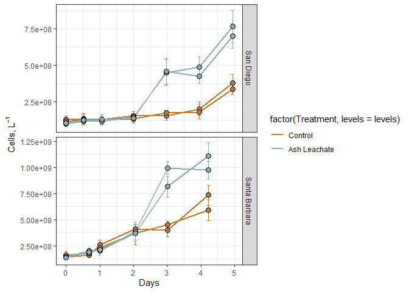
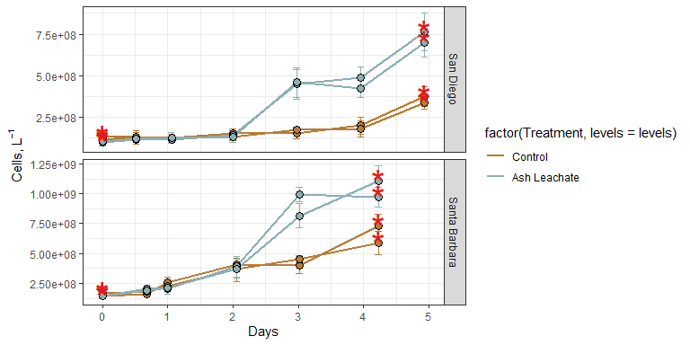
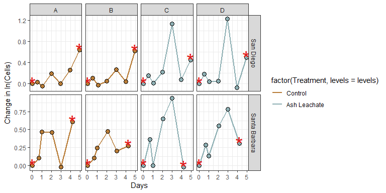
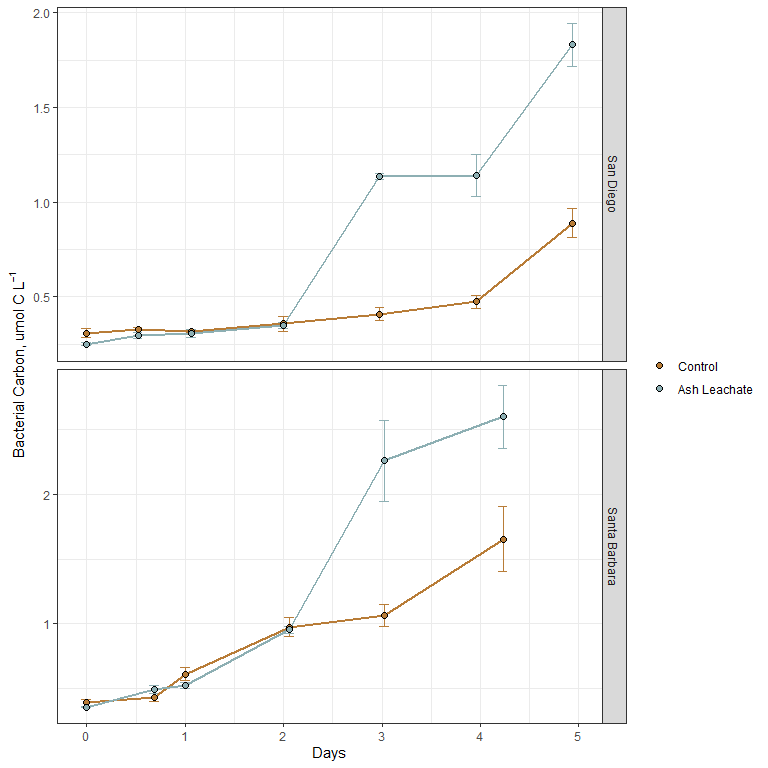
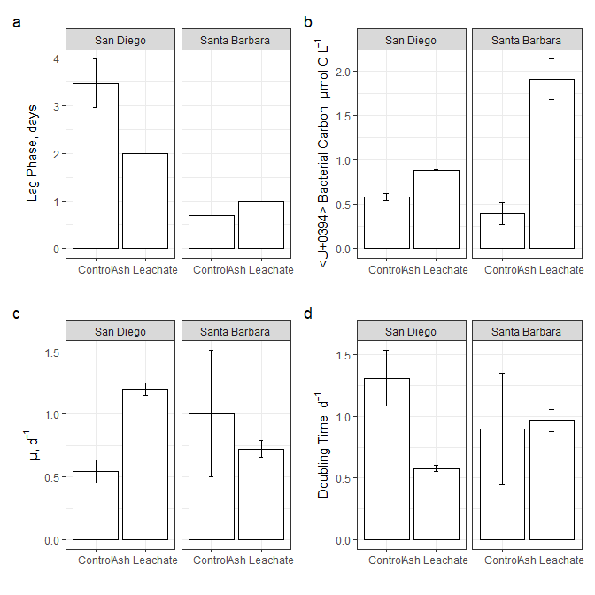

Bacterial Abundance Oceana
================
Oceana Tavasieff
10/21/2020

# Intro

In which data on individual bottle bacterial abundance data from ACIDD
experiements is processed, quality controlled, and analyzed.

``` r
library(tidyverse)
library(readxl)
library(lubridate)
```

# Import data

``` r
excel_sheets("~/Documents/github_144l/144l_students/Input_Data/week3/ACIDD_Exp_BactAbund.xlsx")
```

    ## [1] "Metadata" "Data"

``` r
metadata <- read_excel("~/Documents/github_144l/144l_students/Input_Data/week3/ACIDD_Exp_BactAbund.xlsx", sheet = "Metadata")

#glimpse(metadata)

unique(metadata$Experiment)
```

    ## [1] "ASH171" "ASH172"

``` r
unique(metadata$Location)
```

    ## [1] "San Diego"     "Santa Barbara"

``` r
unique(metadata$Bottle)
```

    ## [1] "A" "B" "C" "D"

``` r
unique(metadata$Treatment)
```

    ## [1] "Control"      "Ash Leachate"

``` r
# Two experiments conducted @ two locations. 
# Four bottles/type total (A-D), with Control (A and B) and Ash Leachate treatment (C and D)

data <- read_excel("~/Documents/github_144l/144l_students/Input_Data/week3/ACIDD_Exp_BactAbund.xlsx", sheet = "Data")

#glimpse(data)

# Shared columns between these two sheets (Data and Metadata).
# Combine into one datasheet

joined <- left_join (metadata, data) #left_join joins the right dataset to the left dataset
```

    ## Joining, by = c("Experiment", "Bottle", "Timepoint")

``` r
#names(joined) # Check our join function
#glimpse(joined)
#summary(joined)

#NA values for Cell_Sample (in Cells/mL)
```

# Prepare Data

Convert date and time columns from character to date values. Add columns
with time elapsed for each experiment (subsetting data by experiment).
Cells/mL to Cells/L (DOC units are in umol C/L). Remove extraneous
columns. Drop NA’s

``` r
cells <- joined %>%  
  mutate(Datetime= ymd_hm(Datetime),
         cells = Cells_ml * 1000,
         sd_cells = Cells_ml_sd * 1000) %>% 
  group_by(Experiment, Treatment, Bottle) %>%  
  mutate(interv1 = interval(start = first(Datetime), end = Datetime),
         interv = as.period(interv1, unit = "second"),
         hours = interv/3600, 
         days = hours/24) %>% ungroup() %>%
  select(Experiment:Nutrient_Sample, hours, days, cells, sd_cells) %>% drop_na(cells)


glimpse(cells)
```

    ## Rows: 52
    ## Columns: 21
    ## $ Experiment              <chr> "ASH171", "ASH171", "ASH171", "ASH171", "AS...
    ## $ Location                <chr> "San Diego", "San Diego", "San Diego", "San...
    ## $ Temperature_C           <dbl> 15, 15, 15, 15, 15, 15, 15, 15, 15, 15, 15,...
    ## $ Depth                   <dbl> 5, 5, 5, 5, 5, 5, 5, 5, 5, 5, 5, 5, 5, 5, 5...
    ## $ Bottle                  <chr> "A", "A", "A", "A", "A", "A", "A", "B", "B"...
    ## $ Timepoint               <dbl> 0, 1, 2, 3, 4, 5, 6, 0, 1, 2, 3, 4, 5, 6, 0...
    ## $ Treatment               <chr> "Control", "Control", "Control", "Control",...
    ## $ Target_DOC_Amendment_uM <dbl> 0, 0, 0, 0, 0, 0, 0, 0, 0, 0, 0, 0, 0, 0, 1...
    ## $ Inoculum_L              <dbl> 1.5, 1.5, 1.5, 1.5, 1.5, 1.5, 1.5, 1.5, 1.5...
    ## $ Media_L                 <dbl> 4, 4, 4, 4, 4, 4, 4, 4, 4, 4, 4, 4, 4, 4, 4...
    ## $ Datetime                <dttm> 2017-12-16 21:30:00, 2017-12-17 10:00:00, ...
    ## $ TOC_Sample              <lgl> TRUE, FALSE, FALSE, FALSE, FALSE, FALSE, FA...
    ## $ DOC_Sample              <lgl> TRUE, TRUE, FALSE, TRUE, FALSE, FALSE, FALS...
    ## $ Parallel_Sample         <lgl> TRUE, FALSE, FALSE, FALSE, FALSE, FALSE, FA...
    ## $ Cell_Sample             <lgl> TRUE, TRUE, TRUE, TRUE, TRUE, TRUE, TRUE, T...
    ## $ DNA_Sample              <lgl> TRUE, FALSE, FALSE, FALSE, FALSE, FALSE, TR...
    ## $ Nutrient_Sample         <lgl> TRUE, FALSE, FALSE, FALSE, FALSE, FALSE, TR...
    ## $ hours                   <Period> 0S, 12.5S, 25.5S, 48S, 71.5S, 95S, 118.5...
    ## $ days                    <Period> 0S, 0.520833333333333S, 1.0625S, 2S, 2.9...
    ## $ cells                   <dbl> 1.30e+08, 1.34e+08, 1.28e+08, 1.55e+08, 1.5...
    ## $ sd_cells                <dbl> 2.09e+07, 2.76e+07, 2.22e+07, 2.52e+07, 3.1...

``` r
#interval fails to return an interval... or rather a period
```

# Plot Growth Curves

``` r
custom.colors <- c("Control" = "#B87C37", "Ash Leachate" = "#8dafb3", "Santa Barbara" = "#dbdb65", "San Diego" = "#db65c5")
  #using hex code
levels <- c("Control", "Ash Leachate", "San Diego", "Santa Barbara")


cells %>% 
  ggplot(aes(x = days, y = cells, group = interaction(Experiment, Treatment, Bottle))) +
  geom_errorbar(aes(ymin = cells-sd_cells, ymax= cells + sd_cells, color= factor(Treatment, levels = levels)), width=0.1) + 
  geom_line(aes(color= factor (Treatment, levels= levels)), size = 1) +
  geom_point(aes(fill = factor(Treatment, levels = levels)), size= 3, color= "black", shape = 21) +
  labs(x = "Days", y= expression(paste("Cells, L"^-1)), fill = "") +
  guides(fill = F) +
  scale_color_manual(values = custom.colors) +
  scale_fill_manual(values = custom.colors) +
  facet_grid(rows = "Location", scales = "free") +
  theme_bw()
```

<!-- -->

``` r
# Lets add a marker for where DNA sample = T (points where we know what the community composition is)
# Set * as the symbol (in geom_text; we also had to create a new column as the * if dna sample was taken; if not, then it printes NA

cells %>% 
  mutate(dna =  ifelse(DNA_Sample == T, "*", NA)) %>% 
  ggplot(aes(x = days, y = cells, group = interaction(Experiment, Treatment, Bottle))) +
  geom_errorbar(aes(ymin = cells-sd_cells, ymax= cells + sd_cells, color= factor(Treatment, levels = levels)), width=0.1) + 
  geom_line(aes(color= factor (Treatment, levels= levels)), size = 1) +
  geom_point(aes(fill = factor(Treatment, levels = levels)), size= 3, color= "black", shape = 21) +
  geom_text(aes(label = dna), size = 10, color = "#e41a1c") + 
  labs(x = "Days", y= expression(paste("Cells, L"^-1)), fill = "") +
  guides(fill = F) +
  scale_color_manual(values = custom.colors) +
  scale_fill_manual(values = custom.colors) +
  facet_grid(rows = "Location", scales = "free") +
  theme_bw()
```

    ## Warning: Removed 36 rows containing missing values (geom_text).

<!-- -->

We can calculate: -Total change in cells from initial conditions to end
of expt - Specific growth rate as slope of ln(abundance) vs time during
exptl growth phase - Doubling time as ln(2) divided by spec growth rate
-mean of each of these parameters for each treatment

First we need to det. where exptl growth phase occurs for each expt (if
it does). Let’s plot ln(abund) vs time.

## Identify Exponential Growth Rates

Recall: log(x) give ln(x) log10(x) gives log base 10 log2(x) gives log
base 2

``` r
ln_cells <- cells %>% group_by(Experiment, Treatment, Bottle) %>% 
  mutate(ln_cells = log(cells),
         diff_ln_cells = ln_cells - lag(ln_cells, default = first(ln_cells))) %>% ungroup()
```

``` r
# View exponential growth


ln_cells %>% 
  mutate(dna =  ifelse(DNA_Sample == T, "*", NA)) %>% 
  ggplot(aes(x = days, y = diff_ln_cells, group = interaction(Experiment, Treatment, Bottle))) + 
  geom_line(aes(color= factor(Treatment, levels = levels)), size = 1) +
  geom_point(aes(fill = factor(Treatment, levels = levels)), size= 3, color= "black", shape = 21) +
  geom_text(aes(label = dna), size = 10, color = "#e41a1c") + 
  labs(x = "Days", y= expression(paste("Change in ln(Cells)")), fill = "") +
  guides(fill = F) +
  scale_color_manual(values = custom.colors) +
  scale_fill_manual(values = custom.colors) +
  facet_grid(rows = Location~Bottle, scales = "free") +
  theme_bw()
```

    ## Warning: Removed 36 rows containing missing values (geom_text).

<!-- -->

``` r
# A-- Exptl growth occurs btw 3-5 days, but for B in 4-5 days
```

# Calculate Growth Rates, Doubling Times, and Change in Cell Abundance

``` r
# ASH171 = Expts in SD, ASH172 = Expts in SB
#growth <- ln_cells %>% 
 # mutate(exp_start = ifelse(Experiment == "ASH171" & Bottle == "A", 4, NA))
      # Adds a column that adds the Timepoint of Exptl growth. for Bottle A, Experiment ash171 (in San Diego), we visually determined that Exptl Growth occurred between 3-5d, then we set midpt/ Timepoint to be 4d. 
# ended exp_start lines with a 4 because many bottles end at Timepoint 4
growth <- ln_cells %>% 
  mutate(exp_start = ifelse(Experiment == "ASH171" & Bottle == "A", 4, NA),
         exp_start = ifelse(Experiment == "ASH171" & Bottle == "B", 5, exp_start),
         exp_start = ifelse(Experiment == "ASH171" & Bottle %in% c("C", "D"), 3, exp_start),
         exp_start = ifelse(Experiment == "ASH172" & Bottle %in% c("A", "B"), 1, exp_start),
         exp_start = ifelse(Experiment == "ASH172" & Bottle %in% c("C", "D"), 2, exp_start),
         exp_end = ifelse(Experiment == "ASH171" & Bottle %in% c("A", "B"), 6,4),
         exp_end = ifelse(Experiment == "ASH172" & Bottle == "A", 2, exp_end),
         exp_end = ifelse(Experiment == "ASH172" & Bottle == "B", 3, exp_end))


check <- growth %>% select (Experiment, Bottle, exp_start, exp_end) %>% distinct() #  double check our work above
```

``` r
# MUTATE to input ln(cell abund) for the start of every exponential growth curve. recall this start corresponds with a particular Timepoint value
growth <- ln_cells %>% 
  mutate(exp_start = ifelse(Experiment == "ASH171" & Bottle == "A", 4, NA),
         exp_start = ifelse(Experiment == "ASH171" & Bottle == "B", 5, exp_start),
         exp_start = ifelse(Experiment == "ASH171" & Bottle %in% c("C", "D"), 3, exp_start),
         exp_start = ifelse(Experiment == "ASH172" & Bottle %in% c("A", "B"), 1, exp_start),
         exp_start = ifelse(Experiment == "ASH172" & Bottle %in% c("C", "D"), 2, exp_start),
         exp_end = ifelse(Experiment == "ASH171" & Bottle %in% c("A", "B"), 6,4),
         exp_end = ifelse(Experiment == "ASH172" & Bottle == "A", 2, exp_end),
         exp_end = ifelse(Experiment == "ASH172" & Bottle == "B", 3, exp_end)) %>%  group_by(Experiment, Treatment, Bottle)  %>% 
  mutate( ln_cells_exp_start = ifelse(Timepoint == exp_start, ln_cells, NA),
          ln_cells_exp_end = ifelse(Timepoint == exp_end, ln_cells, NA),
          cells_exp_start = ifelse (Timepoint == exp_start, cells, NA),
          cells_exp_end = ifelse(Timepoint == exp_end, cells, NA),
          days_exp_start = ifelse (Timepoint == exp_start, days, NA),
          days_exp_end = ifelse(Timepoint == exp_end, days, NA)) %>% 
  fill(ln_cells_exp_start:days_exp_end, .direction= "updown") %>% 
  mutate(mew = (ln_cells_exp_end - ln_cells_exp_start) / ( days_exp_end - days_exp_start),
         doubling = log(2)/mew,
         delta_cells = cells_exp_end - first(cells)) %>% 
  ungroup()

# recall our variables are grouped and so this fill fxn fills only along experiment in this use
```

# Convert Bacterial Abundance and Change in Bact. Abund. to Carbon Units

Apply a Carbon Conversion Factor (CCF) to bact. abundances (cells
L<sup>-1</sup>) to generate bacterial carbon (umol C L<sup>-1</sup>).

We will apply average carbon conversion of bacterioplankton cells from
Coastal JP (\~30fg C cell<sup>-1</sup>), reported by Fukuda et al.,
1998.

``` r
bactcarbon <- growth %>% 
  mutate(bc = cells * (2.5 * 10^-9),
         delta_bc = delta_cells * (2.5 * 10^-9))

glimpse(bactcarbon)
```

    ## Rows: 52
    ## Columns: 36
    ## $ Experiment              <chr> "ASH171", "ASH171", "ASH171", "ASH171", "AS...
    ## $ Location                <chr> "San Diego", "San Diego", "San Diego", "San...
    ## $ Temperature_C           <dbl> 15, 15, 15, 15, 15, 15, 15, 15, 15, 15, 15,...
    ## $ Depth                   <dbl> 5, 5, 5, 5, 5, 5, 5, 5, 5, 5, 5, 5, 5, 5, 5...
    ## $ Bottle                  <chr> "A", "A", "A", "A", "A", "A", "A", "B", "B"...
    ## $ Timepoint               <dbl> 0, 1, 2, 3, 4, 5, 6, 0, 1, 2, 3, 4, 5, 6, 0...
    ## $ Treatment               <chr> "Control", "Control", "Control", "Control",...
    ## $ Target_DOC_Amendment_uM <dbl> 0, 0, 0, 0, 0, 0, 0, 0, 0, 0, 0, 0, 0, 0, 1...
    ## $ Inoculum_L              <dbl> 1.5, 1.5, 1.5, 1.5, 1.5, 1.5, 1.5, 1.5, 1.5...
    ## $ Media_L                 <dbl> 4, 4, 4, 4, 4, 4, 4, 4, 4, 4, 4, 4, 4, 4, 4...
    ## $ Datetime                <dttm> 2017-12-16 21:30:00, 2017-12-17 10:00:00, ...
    ## $ TOC_Sample              <lgl> TRUE, FALSE, FALSE, FALSE, FALSE, FALSE, FA...
    ## $ DOC_Sample              <lgl> TRUE, TRUE, FALSE, TRUE, FALSE, FALSE, FALS...
    ## $ Parallel_Sample         <lgl> TRUE, FALSE, FALSE, FALSE, FALSE, FALSE, FA...
    ## $ Cell_Sample             <lgl> TRUE, TRUE, TRUE, TRUE, TRUE, TRUE, TRUE, T...
    ## $ DNA_Sample              <lgl> TRUE, FALSE, FALSE, FALSE, FALSE, FALSE, TR...
    ## $ Nutrient_Sample         <lgl> TRUE, FALSE, FALSE, FALSE, FALSE, FALSE, TR...
    ## $ hours                   <Period> 0S, 12.5S, 25.5S, 48S, 71.5S, 95S, 118.5...
    ## $ days                    <Period> 0S, 0.520833333333333S, 1.0625S, 2S, 2.9...
    ## $ cells                   <dbl> 1.30e+08, 1.34e+08, 1.28e+08, 1.55e+08, 1.5...
    ## $ sd_cells                <dbl> 2.09e+07, 2.76e+07, 2.22e+07, 2.52e+07, 3.1...
    ## $ ln_cells                <dbl> 18.68305, 18.71335, 18.66754, 18.85894, 18....
    ## $ diff_ln_cells           <dbl> 0.000000000, 0.030305349, -0.045809536, 0.1...
    ## $ exp_start               <dbl> 4, 4, 4, 4, 4, 4, 4, 5, 5, 5, 5, 5, 5, 5, 3...
    ## $ exp_end                 <dbl> 6, 6, 6, 6, 6, 6, 6, 6, 6, 6, 6, 6, 6, 6, 4...
    ## $ ln_cells_exp_start      <dbl> 18.85894, 18.85894, 18.85894, 18.85894, 18....
    ## $ ln_cells_exp_end        <dbl> 19.74776, 19.74776, 19.74776, 19.74776, 19....
    ## $ cells_exp_start         <dbl> 1.55e+08, 1.55e+08, 1.55e+08, 1.55e+08, 1.5...
    ## $ cells_exp_end           <dbl> 3.77e+08, 3.77e+08, 3.77e+08, 3.77e+08, 3.7...
    ## $ days_exp_start          <dbl> 2.979167, 2.979167, 2.979167, 2.979167, 2.9...
    ## $ days_exp_end            <dbl> 4.937500, 4.937500, 4.937500, 4.937500, 4.9...
    ## $ mew                     <dbl> 0.4538656, 0.4538656, 0.4538656, 0.4538656,...
    ## $ doubling                <dbl> 1.5272081, 1.5272081, 1.5272081, 1.5272081,...
    ## $ delta_cells             <dbl> 247000000, 247000000, 247000000, 247000000,...
    ## $ bc                      <dbl> 0.32500, 0.33500, 0.32000, 0.38750, 0.38750...
    ## $ delta_bc                <dbl> 0.61750, 0.61750, 0.61750, 0.61750, 0.61750...

# Calculate Treatment Averages

``` r
#when calculating averages, group data 1st!

averages <- bactcarbon %>% 
  group_by(Experiment, Treatment, Timepoint) %>% 
  mutate(ave_bc = mean(bc),
         sd_bc = sd(bc)) %>% 
  ungroup() %>% 
  group_by(Experiment, Treatment) %>% 
  mutate(ave_mew = mean(mew),
         sd_mew = sd(mew),
         ave_doubling =  mean(doubling),
         sd_doubling = sd(doubling),
         ave_delta_cells = mean(delta_cells),
         sd_delta_cells = sd(delta_cells),
         ave_delta_bc = mean(delta_bc),
         sd_delta_bc = sd(delta_bc),
         ave_lag = mean(days_exp_start),
         sd_lag = sd(days_exp_start)) %>% 
  ungroup()

subset <- averages %>% select(Experiment, Treatment, Timepoint, Bottle, bc, ave_bc, sd_bc)
```

## Plot Treatment Averages

``` r
averages %>% 
  ggplot(aes(x = days, y = ave_bc), group = interaction(Experiment, Treatment)) +
  geom_errorbar(aes(ymin = ave_bc - sd_bc, ymax = ave_bc + sd_bc, color= factor(Treatment, levels = levels)), width = 0.1) +
  geom_line(aes(color = factor(Treatment, levels = levels)), size = 1) +
  geom_point(aes(fill = factor(Treatment, levels = levels)), color = "black", shape = 21, size = 2) +
  facet_grid(rows = "Location", scales = "free") +
  scale_color_manual(values = custom.colors) +
  scale_fill_manual(values = custom.colors) + labs(x = "Days", y = expression("Bacterial Carbon, umol C L"^-1), fill = "", color = "") + guides(color = F) +
  theme_bw()
```

<!-- -->

# Barplots

``` r
bar.data <- averages %>% 
  select(Location, Treatment, ave_mew:sd_lag)
# many duplicated rows, repeat with distinct() fxn to cut down dataset

bar.data <- averages %>% 
  select(Location, Treatment, ave_mew:sd_lag) %>% distinct()
```

``` r
mew <- bar.data %>%
  ggplot(aes(x = factor(Treatment, levels = levels), y =  ave_mew),
         group = interaction(Location, Treatment)) + 
  geom_col(color = "black", fill = "white") +
  geom_errorbar(aes(ymin = ave_mew - sd_mew, ymax = ave_mew + sd_mew), width = 0.1) +
  facet_grid(~factor(Location, levels = levels), scales = "free") +
  labs(x = "", y = expression("μ, d"^-1)) +
  theme_bw()

# FACET_GRID to grid by location
# use tilde before factor in place of rows = or col =  argument
```

``` r
doubling <- bar.data %>%
  ggplot(aes(x = factor(Treatment, levels = levels), y =  ave_doubling),
         group = interaction(Location, Treatment)) + 
  geom_col(color = "black", fill = "white") +
  geom_errorbar(aes(ymin = ave_doubling - sd_doubling, ymax = ave_doubling + sd_doubling), width = 0.1) +
  facet_grid(~factor(Location, levels = levels), scales = "free") +
  labs(x = "", y = expression("Doubling Time, d"^-1)) +
  theme_bw()
```

``` r
delta_bc <- bar.data %>%
  ggplot(aes(x = factor(Treatment, levels = levels), y =  ave_delta_bc),
         group = interaction(Location, Treatment)) + 
  geom_col(color = "black", fill = "white") +
  geom_errorbar(aes(ymin = ave_delta_bc - sd_delta_bc, ymax = ave_delta_bc + sd_delta_bc), width = 0.1) +
  facet_grid(~factor(Location, levels = levels), scales = "free") +
  labs(x = "", y = expression("Δ Bacterial Carbon, μmol C L"^-1)) +
  theme_bw()
```

``` r
lag <- bar.data %>%
  ggplot(aes(x = factor(Treatment, levels = levels), y =  ave_lag),
         group = interaction(Location, Treatment)) + 
  geom_col(color = "black", fill = "white") +
  geom_errorbar(aes(ymin = ave_lag - sd_lag, ymax = ave_lag + sd_lag), width = 0.1) +
  facet_grid(~factor(Location, levels = levels), scales = "free") +
  labs(x = "", y = "Lag Phase, days") +
  theme_bw()
```

## Attach all barplots together

``` r
#install.packages("patchwork")
library(patchwork)
```

    ## Warning: package 'patchwork' was built under R version 4.0.3

``` r
lag + delta_bc + mew + doubling + plot_annotation(tag_levels = "a")
```

<!-- -->

# Save Data

``` r
saveRDS(averages, "~/Documents/github_144l/144l_students/Output_Data/Week 3/ACIDD_Exp_Processed_BactAbund_rds")

#save_csv
```
