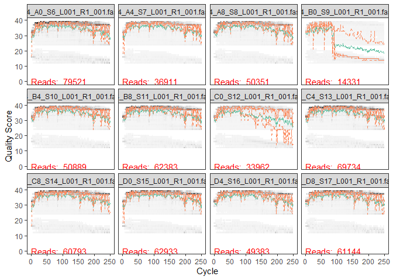
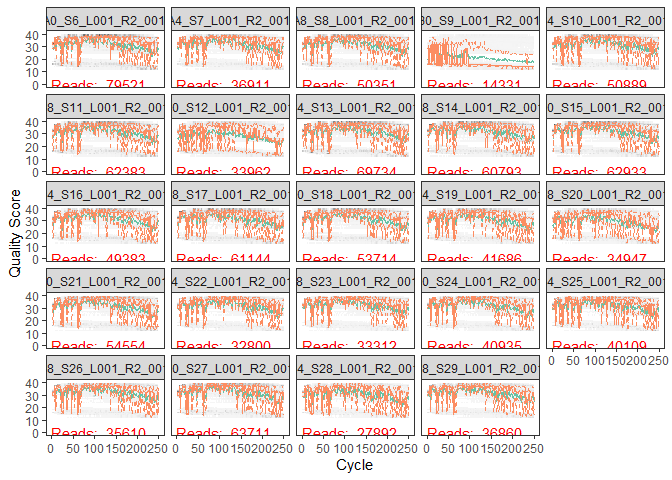
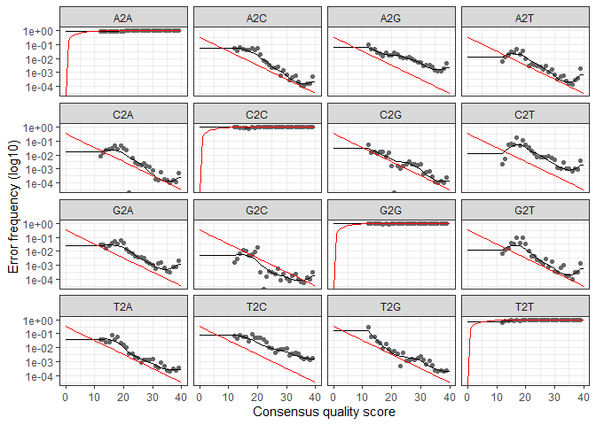

DADA 2 Oceana
================
Oceana Tavasieff
11/13/2020

``` r
#if (!requireNamespace("BiocManager", quietly = TRUE))
    #install.packages("BiocManager")
#BiocManager::install("dada2", version = "3.11")
library(dada2); packageVersion("dada2")
```

    ## [1] '1.16.0'

``` r
library(tidyverse)
```

    ## Warning: package 'dplyr' was built under R version 4.0.3

``` r
library(ShortRead)
```

    ## Warning: package 'matrixStats' was built under R version 4.0.3

``` r
path <- "~/Documents/github_144l/144l_students/Input_Data/week5/EEMB144L_2018_fastq/"
list.files(path) # 24 samples
```

    ##  [1] "144_A0_S6_L001_R1_001.fastq"  "144_A0_S6_L001_R2_001.fastq" 
    ##  [3] "144_A4_S7_L001_R1_001.fastq"  "144_A4_S7_L001_R2_001.fastq" 
    ##  [5] "144_A8_S8_L001_R1_001.fastq"  "144_A8_S8_L001_R2_001.fastq" 
    ##  [7] "144_B0_S9_L001_R1_001.fastq"  "144_B0_S9_L001_R2_001.fastq" 
    ##  [9] "144_B4_S10_L001_R1_001.fastq" "144_B4_S10_L001_R2_001.fastq"
    ## [11] "144_B8_S11_L001_R1_001.fastq" "144_B8_S11_L001_R2_001.fastq"
    ## [13] "144_C0_S12_L001_R1_001.fastq" "144_C0_S12_L001_R2_001.fastq"
    ## [15] "144_C4_S13_L001_R1_001.fastq" "144_C4_S13_L001_R2_001.fastq"
    ## [17] "144_C8_S14_L001_R1_001.fastq" "144_C8_S14_L001_R2_001.fastq"
    ## [19] "144_D0_S15_L001_R1_001.fastq" "144_D0_S15_L001_R2_001.fastq"
    ## [21] "144_D4_S16_L001_R1_001.fastq" "144_D4_S16_L001_R2_001.fastq"
    ## [23] "144_D8_S17_L001_R1_001.fastq" "144_D8_S17_L001_R2_001.fastq"
    ## [25] "144_E0_S18_L001_R1_001.fastq" "144_E0_S18_L001_R2_001.fastq"
    ## [27] "144_E4_S19_L001_R1_001.fastq" "144_E4_S19_L001_R2_001.fastq"
    ## [29] "144_E8_S20_L001_R1_001.fastq" "144_E8_S20_L001_R2_001.fastq"
    ## [31] "144_F0_S21_L001_R1_001.fastq" "144_F0_S21_L001_R2_001.fastq"
    ## [33] "144_F4_S22_L001_R1_001.fastq" "144_F4_S22_L001_R2_001.fastq"
    ## [35] "144_F8_S23_L001_R1_001.fastq" "144_F8_S23_L001_R2_001.fastq"
    ## [37] "144_G0_S24_L001_R1_001.fastq" "144_G0_S24_L001_R2_001.fastq"
    ## [39] "144_G4_S25_L001_R1_001.fastq" "144_G4_S25_L001_R2_001.fastq"
    ## [41] "144_G8_S26_L001_R1_001.fastq" "144_G8_S26_L001_R2_001.fastq"
    ## [43] "144_H0_S27_L001_R1_001.fastq" "144_H0_S27_L001_R2_001.fastq"
    ## [45] "144_H4_S28_L001_R1_001.fastq" "144_H4_S28_L001_R2_001.fastq"
    ## [47] "144_H8_S29_L001_R1_001.fastq" "144_H8_S29_L001_R2_001.fastq"
    ## [49] "filtered"

``` r
# Get matched lists of reads:
# Forward and reverse fastq filenames have format: SAMPLENAME_R1_001.fastq and SAMPLENAME_R2_001.fastq
fnFs <- sort(list.files(path, pattern="_R1_001.fastq", full.names = TRUE))
fnRs <- sort(list.files(path, pattern="_R2_001.fastq", full.names = TRUE))
```

# Check for and remove primers

``` r
FWD <- "GTGYCAGCMGCCGCGGTAA" # for V4 region of 16S
REV <- "GGACTACNVGGGTWTCTAAT" 

allOrients <- function(primer) {
    # Create all orientations of the input sequence
    require(Biostrings)
    dna <- DNAString(primer)  # The Biostrings works w/ DNAString objects rather than character vectors
    orients <- c(Forward = dna, Complement = complement(dna), Reverse = reverse(dna), 
        RevComp = reverseComplement(dna))
    return(sapply(orients, toString))  # Convert back to character vector
}
FWD.orients <- allOrients(FWD)
REV.orients <- allOrients(REV)
FWD.orients
```

    ##               Forward            Complement               Reverse 
    ## "GTGYCAGCMGCCGCGGTAA" "CACRGTCGKCGGCGCCATT" "AATGGCGCCGMCGACYGTG" 
    ##               RevComp 
    ## "TTACCGCGGCKGCTGRCAC"

``` r
REV.orients
```

    ##                Forward             Complement                Reverse 
    ## "GGACTACNVGGGTWTCTAAT" "CCTGATGNBCCCAWAGATTA" "TAATCTWTGGGVNCATCAGG" 
    ##                RevComp 
    ## "ATTAGAWACCCBNGTAGTCC"

## count primers

``` r
primerHits <- function(primer, fn) {
  #Counts no. reads in which primer is found
  nhits <- vcountPattern(primer, sread(readFastq(fn)), fixed =FALSE)
  return(sum(nhits > 0))
}

rbind(FWD.ForwardReads = sapply(FWD.orients, primerHits, fn = fnFs[[1]]),
      FWD.ReverseReads = sapply(FWD.orients, primerHits, fn = fnRs[[1]]),
      REV.ForwardReads = sapply(REV.orients, primerHits, fn = fnFs[[1]]),
      REV.ReverseReads = sapply(REV.orients, primerHits, fn = fnRs[[1]])
)
```

    ##                  Forward Complement Reverse RevComp
    ## FWD.ForwardReads       0          0       0       0
    ## FWD.ReverseReads       0          0       0     283
    ## REV.ForwardReads       0          0       0    1195
    ## REV.ReverseReads       0          0       0       0

``` r
# Want this table to have all zeroes, if a few exist (among 10's of thousands of reads), its ok
# in 2018 data significant number of reverse complement reads
```

# Inspect Read Quality

``` r
plotQualityProfile(fnFs[1:12])
```

<!-- -->

``` r
#inconsistent quality for some samples, but consistent drop around 200 bp
```

``` r
plotQualityProfile(fnRs[1:24])
```

<!-- -->

``` r
#graphs are pretty ugly. best between about 50bp and 150bp. truncate at 150, maybe a way to truncate in between. low quality samples should be dropped in later steps, expecting a pretty big loss of reads. 

# Trimming poor quality regions improves sensitivity of error model
```

# Filter and Trim

``` r
# FIRST, we create new versions of data (dont mess with raw data) and a new folder for filtered reads

# Extract sample names, assuming filenames have format: SAMPLENAME_LXXX.fastq
sample.names <- sapply(strsplit(basename(fnFs), "_L"), `[`, 1)
sample.names
```

    ##  [1] "144_A0_S6"  "144_A4_S7"  "144_A8_S8"  "144_B0_S9"  "144_B4_S10"
    ##  [6] "144_B8_S11" "144_C0_S12" "144_C4_S13" "144_C8_S14" "144_D0_S15"
    ## [11] "144_D4_S16" "144_D8_S17" "144_E0_S18" "144_E4_S19" "144_E8_S20"
    ## [16] "144_F0_S21" "144_F4_S22" "144_F8_S23" "144_G0_S24" "144_G4_S25"
    ## [21] "144_G8_S26" "144_H0_S27" "144_H4_S28" "144_H8_S29"

``` r
#NEXT, create a file path for filtered reads

filt_path <- file.path(path, "filtered")

# FINALLY, tag forward and reverse strings (as they will be trimmed differently) 
# _F is for filtered and trimmed fwd reads, _R for rev
# file names will be saved as sample_name + string (_F_filt.fastq)

filtFs <- file.path(path, "filtered", paste0(sample.names, "_F_filt.fastq.gz"))
filtRs <- file.path(path, "filtered", paste0(sample.names, "_R_filt.fastq.gz"))
```

We’ll use standard filtering parameters: maxN=0 (DADA2 requires no Ns),
truncQ=2, rm.phix=TRUE and maxEE=2. The maxEE parameter sets the maximum
number of “expected errors” allowed in a read, which is a better filter
than simply averaging quality scores.

``` r
out <- filterAndTrim(fnFs, filtFs, fnRs, filtRs, truncLen=c(200,150),
              maxN=0, maxEE=c(2,2), truncQ=2, rm.phix=TRUE,
              compress=TRUE, multithread=FALSE) # On Windows set multithread=FALSE
# takes a few minutes to run
# truncLen set based on visualizing quality scores for fwd, rev reads

# sadly 50:150 does not work for reverse reads, will likely lead to losses in filter step.

# maxN removes any "ambiguous" base reads. when in sequencing N is used as a placeholder for an uncertain nucleotide
out #similar number of reads in and out for all but 144_B0_S9_L001_R1_001.fastq, which is expected given its very poor quality graphs.
```

    ##                              reads.in reads.out
    ## 144_A0_S6_L001_R1_001.fastq     79521     70868
    ## 144_A4_S7_L001_R1_001.fastq     36911     33172
    ## 144_A8_S8_L001_R1_001.fastq     50351     45283
    ## 144_B0_S9_L001_R1_001.fastq     14331      3286
    ## 144_B4_S10_L001_R1_001.fastq    50889     45432
    ## 144_B8_S11_L001_R1_001.fastq    62383     56216
    ## 144_C0_S12_L001_R1_001.fastq    33962     25214
    ## 144_C4_S13_L001_R1_001.fastq    69734     62942
    ## 144_C8_S14_L001_R1_001.fastq    60793     54965
    ## 144_D0_S15_L001_R1_001.fastq    62933     57502
    ## 144_D4_S16_L001_R1_001.fastq    49383     44769
    ## 144_D8_S17_L001_R1_001.fastq    61144     55119
    ## 144_E0_S18_L001_R1_001.fastq    53714     49019
    ## 144_E4_S19_L001_R1_001.fastq    41686     37467
    ## 144_E8_S20_L001_R1_001.fastq    34947     30413
    ## 144_F0_S21_L001_R1_001.fastq    54554     49975
    ## 144_F4_S22_L001_R1_001.fastq    32800     29889
    ## 144_F8_S23_L001_R1_001.fastq    33312     30792
    ## 144_G0_S24_L001_R1_001.fastq    40935     37648
    ## 144_G4_S25_L001_R1_001.fastq    40109     36506
    ## 144_G8_S26_L001_R1_001.fastq    35610     32774
    ## 144_H0_S27_L001_R1_001.fastq    63711     59242
    ## 144_H4_S28_L001_R1_001.fastq    27892     25062
    ## 144_H8_S29_L001_R1_001.fastq    36860     33766

``` r
# Now we have some "high quality sequences"
```

# Error model

Probablity that a particular base pair in a sequence is real, help
determine real differences.

``` r
errF <- learnErrors(filtFs, multithread=FALSE)
```

    ## 110953600 total bases in 554768 reads from 12 samples will be used for learning the error rates.

``` r
errR <- learnErrors(filtRs, multithread=F)
```

    ## 100750050 total bases in 671667 reads from 15 samples will be used for learning the error rates.

## Visualize error model results

``` r
plotErrors(errF, nominalQ=TRUE)
```

    ## Warning: Transformation introduced infinite values in continuous y-axis
    
    ## Warning: Transformation introduced infinite values in continuous y-axis

<!-- -->

``` r
# Shows possible transition rates for nucleotides (eg. A to a C) in sequencing. points are observed error rates based on quality scores. red line shows error rates expected. black line is model fit to error rates. error rates decrease with quality score
```

# Dereplication

DADA2 combines all identical sequences into one unique sequence, then
tally the number of unique sequences (ASVs).

``` r
derepFs <- derepFastq(filtFs, verbose = TRUE)
```

    ## Dereplicating sequence entries in Fastq file: ~/Documents/github_144l/144l_students/Input_Data/week5/EEMB144L_2018_fastq//filtered/144_A0_S6_F_filt.fastq.gz

    ## Encountered 17611 unique sequences from 70868 total sequences read.

    ## Dereplicating sequence entries in Fastq file: ~/Documents/github_144l/144l_students/Input_Data/week5/EEMB144L_2018_fastq//filtered/144_A4_S7_F_filt.fastq.gz

    ## Encountered 8523 unique sequences from 33172 total sequences read.

    ## Dereplicating sequence entries in Fastq file: ~/Documents/github_144l/144l_students/Input_Data/week5/EEMB144L_2018_fastq//filtered/144_A8_S8_F_filt.fastq.gz

    ## Encountered 11776 unique sequences from 45283 total sequences read.

    ## Dereplicating sequence entries in Fastq file: ~/Documents/github_144l/144l_students/Input_Data/week5/EEMB144L_2018_fastq//filtered/144_B0_S9_F_filt.fastq.gz

    ## Encountered 1394 unique sequences from 3286 total sequences read.

    ## Dereplicating sequence entries in Fastq file: ~/Documents/github_144l/144l_students/Input_Data/week5/EEMB144L_2018_fastq//filtered/144_B4_S10_F_filt.fastq.gz

    ## Encountered 10927 unique sequences from 45432 total sequences read.

    ## Dereplicating sequence entries in Fastq file: ~/Documents/github_144l/144l_students/Input_Data/week5/EEMB144L_2018_fastq//filtered/144_B8_S11_F_filt.fastq.gz

    ## Encountered 13739 unique sequences from 56216 total sequences read.

    ## Dereplicating sequence entries in Fastq file: ~/Documents/github_144l/144l_students/Input_Data/week5/EEMB144L_2018_fastq//filtered/144_C0_S12_F_filt.fastq.gz

    ## Encountered 7426 unique sequences from 25214 total sequences read.

    ## Dereplicating sequence entries in Fastq file: ~/Documents/github_144l/144l_students/Input_Data/week5/EEMB144L_2018_fastq//filtered/144_C4_S13_F_filt.fastq.gz

    ## Encountered 12758 unique sequences from 62942 total sequences read.

    ## Dereplicating sequence entries in Fastq file: ~/Documents/github_144l/144l_students/Input_Data/week5/EEMB144L_2018_fastq//filtered/144_C8_S14_F_filt.fastq.gz

    ## Encountered 12894 unique sequences from 54965 total sequences read.

    ## Dereplicating sequence entries in Fastq file: ~/Documents/github_144l/144l_students/Input_Data/week5/EEMB144L_2018_fastq//filtered/144_D0_S15_F_filt.fastq.gz

    ## Encountered 13967 unique sequences from 57502 total sequences read.

    ## Dereplicating sequence entries in Fastq file: ~/Documents/github_144l/144l_students/Input_Data/week5/EEMB144L_2018_fastq//filtered/144_D4_S16_F_filt.fastq.gz

    ## Encountered 8744 unique sequences from 44769 total sequences read.

    ## Dereplicating sequence entries in Fastq file: ~/Documents/github_144l/144l_students/Input_Data/week5/EEMB144L_2018_fastq//filtered/144_D8_S17_F_filt.fastq.gz

    ## Encountered 13616 unique sequences from 55119 total sequences read.

    ## Dereplicating sequence entries in Fastq file: ~/Documents/github_144l/144l_students/Input_Data/week5/EEMB144L_2018_fastq//filtered/144_E0_S18_F_filt.fastq.gz

    ## Encountered 12580 unique sequences from 49019 total sequences read.

    ## Dereplicating sequence entries in Fastq file: ~/Documents/github_144l/144l_students/Input_Data/week5/EEMB144L_2018_fastq//filtered/144_E4_S19_F_filt.fastq.gz

    ## Encountered 8678 unique sequences from 37467 total sequences read.

    ## Dereplicating sequence entries in Fastq file: ~/Documents/github_144l/144l_students/Input_Data/week5/EEMB144L_2018_fastq//filtered/144_E8_S20_F_filt.fastq.gz

    ## Encountered 7830 unique sequences from 30413 total sequences read.

    ## Dereplicating sequence entries in Fastq file: ~/Documents/github_144l/144l_students/Input_Data/week5/EEMB144L_2018_fastq//filtered/144_F0_S21_F_filt.fastq.gz

    ## Encountered 12981 unique sequences from 49975 total sequences read.

    ## Dereplicating sequence entries in Fastq file: ~/Documents/github_144l/144l_students/Input_Data/week5/EEMB144L_2018_fastq//filtered/144_F4_S22_F_filt.fastq.gz

    ## Encountered 7337 unique sequences from 29889 total sequences read.

    ## Dereplicating sequence entries in Fastq file: ~/Documents/github_144l/144l_students/Input_Data/week5/EEMB144L_2018_fastq//filtered/144_F8_S23_F_filt.fastq.gz

    ## Encountered 7303 unique sequences from 30792 total sequences read.

    ## Dereplicating sequence entries in Fastq file: ~/Documents/github_144l/144l_students/Input_Data/week5/EEMB144L_2018_fastq//filtered/144_G0_S24_F_filt.fastq.gz

    ## Encountered 9886 unique sequences from 37648 total sequences read.

    ## Dereplicating sequence entries in Fastq file: ~/Documents/github_144l/144l_students/Input_Data/week5/EEMB144L_2018_fastq//filtered/144_G4_S25_F_filt.fastq.gz

    ## Encountered 7586 unique sequences from 36506 total sequences read.

    ## Dereplicating sequence entries in Fastq file: ~/Documents/github_144l/144l_students/Input_Data/week5/EEMB144L_2018_fastq//filtered/144_G8_S26_F_filt.fastq.gz

    ## Encountered 7592 unique sequences from 32774 total sequences read.

    ## Dereplicating sequence entries in Fastq file: ~/Documents/github_144l/144l_students/Input_Data/week5/EEMB144L_2018_fastq//filtered/144_H0_S27_F_filt.fastq.gz

    ## Encountered 13584 unique sequences from 59242 total sequences read.

    ## Dereplicating sequence entries in Fastq file: ~/Documents/github_144l/144l_students/Input_Data/week5/EEMB144L_2018_fastq//filtered/144_H4_S28_F_filt.fastq.gz

    ## Encountered 5261 unique sequences from 25062 total sequences read.

    ## Dereplicating sequence entries in Fastq file: ~/Documents/github_144l/144l_students/Input_Data/week5/EEMB144L_2018_fastq//filtered/144_H8_S29_F_filt.fastq.gz

    ## Encountered 8537 unique sequences from 33766 total sequences read.

``` r
derepRs <- derepFastq(filtRs, verbose = TRUE)
```

    ## Dereplicating sequence entries in Fastq file: ~/Documents/github_144l/144l_students/Input_Data/week5/EEMB144L_2018_fastq//filtered/144_A0_S6_R_filt.fastq.gz

    ## Encountered 24175 unique sequences from 70868 total sequences read.

    ## Dereplicating sequence entries in Fastq file: ~/Documents/github_144l/144l_students/Input_Data/week5/EEMB144L_2018_fastq//filtered/144_A4_S7_R_filt.fastq.gz

    ## Encountered 11316 unique sequences from 33172 total sequences read.

    ## Dereplicating sequence entries in Fastq file: ~/Documents/github_144l/144l_students/Input_Data/week5/EEMB144L_2018_fastq//filtered/144_A8_S8_R_filt.fastq.gz

    ## Encountered 16625 unique sequences from 45283 total sequences read.

    ## Dereplicating sequence entries in Fastq file: ~/Documents/github_144l/144l_students/Input_Data/week5/EEMB144L_2018_fastq//filtered/144_B0_S9_R_filt.fastq.gz

    ## Encountered 1770 unique sequences from 3286 total sequences read.

    ## Dereplicating sequence entries in Fastq file: ~/Documents/github_144l/144l_students/Input_Data/week5/EEMB144L_2018_fastq//filtered/144_B4_S10_R_filt.fastq.gz

    ## Encountered 15567 unique sequences from 45432 total sequences read.

    ## Dereplicating sequence entries in Fastq file: ~/Documents/github_144l/144l_students/Input_Data/week5/EEMB144L_2018_fastq//filtered/144_B8_S11_R_filt.fastq.gz

    ## Encountered 20652 unique sequences from 56216 total sequences read.

    ## Dereplicating sequence entries in Fastq file: ~/Documents/github_144l/144l_students/Input_Data/week5/EEMB144L_2018_fastq//filtered/144_C0_S12_R_filt.fastq.gz

    ## Encountered 12162 unique sequences from 25214 total sequences read.

    ## Dereplicating sequence entries in Fastq file: ~/Documents/github_144l/144l_students/Input_Data/week5/EEMB144L_2018_fastq//filtered/144_C4_S13_R_filt.fastq.gz

    ## Encountered 19438 unique sequences from 62942 total sequences read.

    ## Dereplicating sequence entries in Fastq file: ~/Documents/github_144l/144l_students/Input_Data/week5/EEMB144L_2018_fastq//filtered/144_C8_S14_R_filt.fastq.gz

    ## Encountered 18981 unique sequences from 54965 total sequences read.

    ## Dereplicating sequence entries in Fastq file: ~/Documents/github_144l/144l_students/Input_Data/week5/EEMB144L_2018_fastq//filtered/144_D0_S15_R_filt.fastq.gz

    ## Encountered 20947 unique sequences from 57502 total sequences read.

    ## Dereplicating sequence entries in Fastq file: ~/Documents/github_144l/144l_students/Input_Data/week5/EEMB144L_2018_fastq//filtered/144_D4_S16_R_filt.fastq.gz

    ## Encountered 14888 unique sequences from 44769 total sequences read.

    ## Dereplicating sequence entries in Fastq file: ~/Documents/github_144l/144l_students/Input_Data/week5/EEMB144L_2018_fastq//filtered/144_D8_S17_R_filt.fastq.gz

    ## Encountered 21171 unique sequences from 55119 total sequences read.

    ## Dereplicating sequence entries in Fastq file: ~/Documents/github_144l/144l_students/Input_Data/week5/EEMB144L_2018_fastq//filtered/144_E0_S18_R_filt.fastq.gz

    ## Encountered 18785 unique sequences from 49019 total sequences read.

    ## Dereplicating sequence entries in Fastq file: ~/Documents/github_144l/144l_students/Input_Data/week5/EEMB144L_2018_fastq//filtered/144_E4_S19_R_filt.fastq.gz

    ## Encountered 14665 unique sequences from 37467 total sequences read.

    ## Dereplicating sequence entries in Fastq file: ~/Documents/github_144l/144l_students/Input_Data/week5/EEMB144L_2018_fastq//filtered/144_E8_S20_R_filt.fastq.gz

    ## Encountered 15767 unique sequences from 30413 total sequences read.

    ## Dereplicating sequence entries in Fastq file: ~/Documents/github_144l/144l_students/Input_Data/week5/EEMB144L_2018_fastq//filtered/144_F0_S21_R_filt.fastq.gz

    ## Encountered 19823 unique sequences from 49975 total sequences read.

    ## Dereplicating sequence entries in Fastq file: ~/Documents/github_144l/144l_students/Input_Data/week5/EEMB144L_2018_fastq//filtered/144_F4_S22_R_filt.fastq.gz

    ## Encountered 10390 unique sequences from 29889 total sequences read.

    ## Dereplicating sequence entries in Fastq file: ~/Documents/github_144l/144l_students/Input_Data/week5/EEMB144L_2018_fastq//filtered/144_F8_S23_R_filt.fastq.gz

    ## Encountered 10140 unique sequences from 30792 total sequences read.

    ## Dereplicating sequence entries in Fastq file: ~/Documents/github_144l/144l_students/Input_Data/week5/EEMB144L_2018_fastq//filtered/144_G0_S24_R_filt.fastq.gz

    ## Encountered 14019 unique sequences from 37648 total sequences read.

    ## Dereplicating sequence entries in Fastq file: ~/Documents/github_144l/144l_students/Input_Data/week5/EEMB144L_2018_fastq//filtered/144_G4_S25_R_filt.fastq.gz

    ## Encountered 12399 unique sequences from 36506 total sequences read.

    ## Dereplicating sequence entries in Fastq file: ~/Documents/github_144l/144l_students/Input_Data/week5/EEMB144L_2018_fastq//filtered/144_G8_S26_R_filt.fastq.gz

    ## Encountered 10835 unique sequences from 32774 total sequences read.

    ## Dereplicating sequence entries in Fastq file: ~/Documents/github_144l/144l_students/Input_Data/week5/EEMB144L_2018_fastq//filtered/144_H0_S27_R_filt.fastq.gz

    ## Encountered 20646 unique sequences from 59242 total sequences read.

    ## Dereplicating sequence entries in Fastq file: ~/Documents/github_144l/144l_students/Input_Data/week5/EEMB144L_2018_fastq//filtered/144_H4_S28_R_filt.fastq.gz

    ## Encountered 10356 unique sequences from 25062 total sequences read.

    ## Dereplicating sequence entries in Fastq file: ~/Documents/github_144l/144l_students/Input_Data/week5/EEMB144L_2018_fastq//filtered/144_H8_S29_R_filt.fastq.gz

    ## Encountered 12193 unique sequences from 33766 total sequences read.

``` r
# assign names to derep-class objects from sample nales
names(derepFs) <- sample.names
names(derepRs) <- sample.names
```

# Infer Sequence Variants

Apply dada2 sample inference algorithim to derep data/ Removve sequence
variantes with excessive error rates.

``` r
dadaFs <- dada(derepFs, err=errF, multithread=TRUE)
```

    ## Sample 1 - 70868 reads in 17611 unique sequences.
    ## Sample 2 - 33172 reads in 8523 unique sequences.
    ## Sample 3 - 45283 reads in 11776 unique sequences.
    ## Sample 4 - 3286 reads in 1394 unique sequences.
    ## Sample 5 - 45432 reads in 10927 unique sequences.
    ## Sample 6 - 56216 reads in 13739 unique sequences.
    ## Sample 7 - 25214 reads in 7426 unique sequences.
    ## Sample 8 - 62942 reads in 12758 unique sequences.
    ## Sample 9 - 54965 reads in 12894 unique sequences.
    ## Sample 10 - 57502 reads in 13967 unique sequences.
    ## Sample 11 - 44769 reads in 8744 unique sequences.
    ## Sample 12 - 55119 reads in 13616 unique sequences.
    ## Sample 13 - 49019 reads in 12580 unique sequences.
    ## Sample 14 - 37467 reads in 8678 unique sequences.
    ## Sample 15 - 30413 reads in 7830 unique sequences.
    ## Sample 16 - 49975 reads in 12981 unique sequences.
    ## Sample 17 - 29889 reads in 7337 unique sequences.
    ## Sample 18 - 30792 reads in 7303 unique sequences.
    ## Sample 19 - 37648 reads in 9886 unique sequences.
    ## Sample 20 - 36506 reads in 7586 unique sequences.
    ## Sample 21 - 32774 reads in 7592 unique sequences.
    ## Sample 22 - 59242 reads in 13584 unique sequences.
    ## Sample 23 - 25062 reads in 5261 unique sequences.
    ## Sample 24 - 33766 reads in 8537 unique sequences.

``` r
dadaRs <- dada(derepRs, err=errR, multithread=TRUE)
```

    ## Sample 1 - 70868 reads in 24175 unique sequences.
    ## Sample 2 - 33172 reads in 11316 unique sequences.
    ## Sample 3 - 45283 reads in 16625 unique sequences.
    ## Sample 4 - 3286 reads in 1770 unique sequences.
    ## Sample 5 - 45432 reads in 15567 unique sequences.
    ## Sample 6 - 56216 reads in 20652 unique sequences.
    ## Sample 7 - 25214 reads in 12162 unique sequences.
    ## Sample 8 - 62942 reads in 19438 unique sequences.
    ## Sample 9 - 54965 reads in 18981 unique sequences.
    ## Sample 10 - 57502 reads in 20947 unique sequences.
    ## Sample 11 - 44769 reads in 14888 unique sequences.
    ## Sample 12 - 55119 reads in 21171 unique sequences.
    ## Sample 13 - 49019 reads in 18785 unique sequences.
    ## Sample 14 - 37467 reads in 14665 unique sequences.
    ## Sample 15 - 30413 reads in 15767 unique sequences.
    ## Sample 16 - 49975 reads in 19823 unique sequences.
    ## Sample 17 - 29889 reads in 10390 unique sequences.
    ## Sample 18 - 30792 reads in 10140 unique sequences.
    ## Sample 19 - 37648 reads in 14019 unique sequences.
    ## Sample 20 - 36506 reads in 12399 unique sequences.
    ## Sample 21 - 32774 reads in 10835 unique sequences.
    ## Sample 22 - 59242 reads in 20646 unique sequences.
    ## Sample 23 - 25062 reads in 10356 unique sequences.
    ## Sample 24 - 33766 reads in 12193 unique sequences.

## Merge overlapping reads

Will decrease ASVs.

**IF there were hits for reverse complements in the FWD. reverse reads
and REV forwardreads, can be trimmed with arg: trimOverhang = T. **

``` r
mergers <- mergePairs(dadaFs, derepFs, dadaRs, derepRs, verbose = TRUE, trimOverhang = T) 
```

    ## 67483 paired-reads (in 337 unique pairings) successfully merged out of 70022 (in 922 pairings) input.

    ## 31551 paired-reads (in 167 unique pairings) successfully merged out of 32575 (in 494 pairings) input.

    ## 43338 paired-reads (in 229 unique pairings) successfully merged out of 44671 (in 636 pairings) input.

    ## 2834 paired-reads (in 70 unique pairings) successfully merged out of 3053 (in 180 pairings) input.

    ## 43573 paired-reads (in 190 unique pairings) successfully merged out of 44831 (in 563 pairings) input.

    ## 53941 paired-reads (in 249 unique pairings) successfully merged out of 55511 (in 684 pairings) input.

    ## 23409 paired-reads (in 207 unique pairings) successfully merged out of 24631 (in 532 pairings) input.

    ## 61130 paired-reads (in 173 unique pairings) successfully merged out of 62171 (in 546 pairings) input.

    ## 53095 paired-reads (in 229 unique pairings) successfully merged out of 54428 (in 573 pairings) input.

    ## 54684 paired-reads (in 301 unique pairings) successfully merged out of 56654 (in 726 pairings) input.

    ## 43394 paired-reads (in 124 unique pairings) successfully merged out of 44320 (in 348 pairings) input.

    ## 53163 paired-reads (in 220 unique pairings) successfully merged out of 54534 (in 555 pairings) input.

    ## 46510 paired-reads (in 266 unique pairings) successfully merged out of 48215 (in 613 pairings) input.

    ## 35878 paired-reads (in 163 unique pairings) successfully merged out of 37028 (in 438 pairings) input.

    ## 28465 paired-reads (in 162 unique pairings) successfully merged out of 29769 (in 527 pairings) input.

    ## 46737 paired-reads (in 255 unique pairings) successfully merged out of 48889 (in 655 pairings) input.

    ## 28793 paired-reads (in 138 unique pairings) successfully merged out of 29584 (in 299 pairings) input.

    ## 29670 paired-reads (in 190 unique pairings) successfully merged out of 30477 (in 354 pairings) input.

    ## 35738 paired-reads (in 227 unique pairings) successfully merged out of 37034 (in 454 pairings) input.

    ## 35285 paired-reads (in 138 unique pairings) successfully merged out of 36108 (in 376 pairings) input.

    ## 31372 paired-reads (in 158 unique pairings) successfully merged out of 32262 (in 325 pairings) input.

    ## 54345 paired-reads (in 299 unique pairings) successfully merged out of 58427 (in 622 pairings) input.

    ## 23997 paired-reads (in 119 unique pairings) successfully merged out of 24775 (in 324 pairings) input.

    ## 32510 paired-reads (in 162 unique pairings) successfully merged out of 33296 (in 319 pairings) input.

``` r
# merge fwd and reverse reads
```

``` r
head(mergers[[1]])
```

    ##                                                                                                                                                                                                                                                        sequence
    ## 1 TACGGAGGGTGCAAGCGTTACTCGGAATCACTGGGCGTAAAGAGCGTGTAGGCGGATAGTTAAGTTTGAAGTGAAATCCTATGGCTCAACCATAGAACTGCTTTGAAAACTGATTATCTAGAATATGGGAGAGGTAGATGGAATTTCTGGTGTAGGGGTAAAATCCGTAGAGATCAGAAGGAATACCGATTGCGAAGGCGATCTACTGGAACATTATTGACGCTGAGACGCGAAAGCGTGGGGAGCAAACAGG
    ## 2 TACGGAGGGTCCGAGCGTTAATCGGAATTACTGGGCGTAAAGCGCGCGTAGGTGGTTTTGTCAGTCAGATGTGAAAGCCCAGGGCTCAACCTTGGAACTGCACCTGATACTGCAAGACTAGAGTACAATAGAGGGGAGTGGAATTTCCGGTGTAGCGGTGAAATGCGTAGAGATCGGAAGGAACACCAGTGGCGAAGGCGACTCCCTGGATTGATACTGACACTGAGGTGCGAAAGCGTGGGGAGCAAACAGG
    ## 3 TACGGAAGGTGCAAGCGTTAATCGGAATTACTGGGCGTAAAGCGCGCGTAGGTGGTTTGTTAAGTTGGATGTGAAAGCCCTGGGCTCAACCTAGGAACTGCATCCAAAACTAACTCACTAGAGTACGATAGAGGGAGGTAGAATTCATAGTGTAGCGGTGGAATGCGTAGATATTATGAAGAATACCAGTGGCGAAGGCGGCCTCCTGGATCTGTACTGACACTGAGGTGCGAAAGCGTGGGTAGCGAACAGG
    ## 4 TACGAAGGGACCTAGCGTAGTTCGGAATTACTGGGCTTAAAGAGTTCGTAGGTGGTTGAAAAAGTTAGTGGTGAAATCCCAGAGCTTAACTCTGGAACTGCCATTAAAACTTTTCAGCTAGAGTATGATAGAGGAAAGCAGAATTTCTAGTGTAGAGGTGAAATTCGTAGATATTAGAAAGAATACCAATTGCGAAGGCAGCTTTCTGGATCATTACTGACACTGAGGAACGAAAGCATGGGTAGCGAAGAGG
    ## 5 TACGAAGGGACCTAGCGTAGTTCGGAATTACTGGGCTTAAAGAGTTCGTAGGTGGTTGAAAAAGTTAGTGGTGAAATCCCAGAGCTTAACTCTGGAACTGCCATTAAAACTTTTCAGCTAGAGTATGATAGAGGAAAGCAGAATTTCTAGTGTAGAGGTGAAATTCGTAGATATTAGAAAGAATACCAATTGCGAAGGCAGCTTTCTGGATCATTACTGACACTGAGGAGCGAAAGCATGGGTAGCGAAGAGG
    ## 6 TACGGGAGTGGCAAGCGTTATCCGGAATTATTGGGCGTAAAGCGTCCGCAGGCGGCCCTTCAAGTCTGCTGTTAAAAAGTGGAGCTTAACTCCATCATGGCAGTGGAAACTGAGGGGCTTGAGTGTGGTAGGGGCAGAGGGAATTCCCGGTGTAGCGGTGAAATGCGTAGATATCGGGAAGAACACCAGTGGCGAAGGCGCTCTGCTGGGCCATCACTGACGCTCATGGACGAAAGCCAGGGGAGCGAAAGGG
    ##   abundance forward reverse nmatch nmismatch nindel prefer accept
    ## 1      3773       2       1     97         0      0      1   TRUE
    ## 2      3731       3       3     97         0      0      1   TRUE
    ## 3      3139       4       4     97         0      0      1   TRUE
    ## 4      3039       1       2     97         0      0      1   TRUE
    ## 5      2714       1       5     97         0      0      1   TRUE
    ## 6      2390       5       6     97         0      0      1   TRUE

## Save unassigned reads

``` r
saveRDS(mergers, "~/Documents/github_144l/144l_students/Output_Data/Week 5/dada_merged.rds")
saveRDS(mergers, "~/Documents/github_144l/144l_students/Input_Data/week6/dada_merged.rds")
```

# Construct sequence table (\~OTU table)

``` r
seqtab <- makeSequenceTable(mergers)
dim(seqtab) # 16 samples, XX =  numbers of unique sequences
```

    ## [1]  24 971

``` r
table(nchar(getSequences(seqtab)))
```

    ## 
    ## 252 253 254 255 256 257 258 265 266 270 
    ##  25 874  52   4   5   2   4   1   1   3

``` r
# distribution of sequence lengths. Compare to spread of ITS (ITS has much broader)
```

# Remove Chimeras

Chimeras are basically PCR elements that combine; meaning non-biological
sequences

``` r
seqtab.nochim <- removeBimeraDenovo(seqtab, method="consensus", multithread=TRUE, verbose=TRUE)
```

    ## Identified 80 bimeras out of 971 input sequences.

``` r
# columns = unique sequences, rows = sample names, data = abundance
dim(seqtab.nochim) # compare dimensions
```

    ## [1]  24 891

``` r
sum(seqtab.nochim)/sum(seqtab) # percent samples retained
```

    ## [1] 0.9933968

# Assign Taxonomy

Using Silva database

``` r
taxa <- assignTaxonomy(seqtab.nochim, "~/Documents/github_144l/144l_students/Input_Data/week5/Reference_Database/silva_nr_v138_train_set.fa", multithread = TRUE)
```

``` r
#Create table of taxa data, one with sequences and assignments, one with just taxa

saveRDS(t(seqtab.nochim), "~/Documents/github_144l/144l_students/Output_Data/Week 5/seqtab-nochimtaxa.rds") # t is transpose so that we switch column and row names


saveRDS(taxa, "~/Documents/github_144l/144l_students/Output_Data/Week 5/taxa.rds")


saveRDS(t(seqtab.nochim), "~/Documents/github_144l/144l_students/Input_Data/week6/seqtab-nochimtaxa.rds") # t is transpose so that we switch column and row names
saveRDS(taxa, "~/Documents/github_144l/144l_students/Input_Data/week6/taxa.rds")
```
